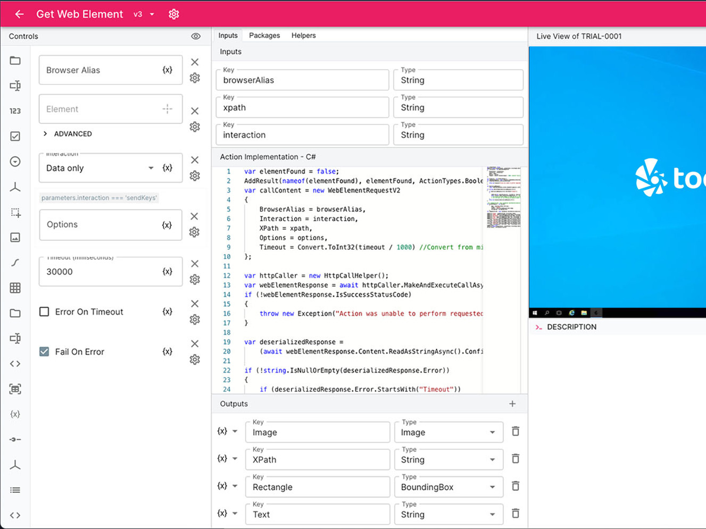

# Toca Documentation Introduction

Welcome to the documentation landing page for Toca. This repository serves as the central hub for all instructional content and links associated with the Toca platform.

## A Community-Driven Vision

Toca's success is deeply intertwined with the invaluable contributions of our partners and community members. As part of this open-source community, your insights, expertise, and feedback actively shape our documentation. We believe that collective wisdom is greater than any individual's, and your participation ensures that our guides, tutorials, and references are as comprehensive and up-to-date as possible.

## The Importance of Documentation

The significance of robust and current documentation cannot be overstated. It is crucial for enabling users to fully utilise the platform, understand new features, and find solutions to common challenges. By centralising this information, we aim to provide an easily navigable and consistent resource that supports both new and experienced users on their journey with Toca.

## Change Is Constant

Toca is a rapidly evolving platform. Therefore, please be aware that some information may immediately be subject to change due to various new features and updates. Our community-driven approach aims to keep the documentation in pace with these changes, but there may be moments when certain data is in the process of being updated.

## Contributing to the Documentation

If you wish to contribute to this invaluable resource, please review the following guidelines and resources:

1. [Contribution Guidelines](https://github.com/tocalabs/user-guide/blob/rebuild-project/contribution-guidelines.md)
2. [Style Guide](https://github.com/tocalabs/user-guide/blob/rebuild-project/style-guide.md)
3. [Code of Conduct](https://github.com/tocalabs/user-guide/blob/rebuild-project/code-of-conduct.md)

## Need Help?

If you have questions or need assistance at any stage, please refer to our [Contribution Guidelines](link-to-contribution-guidelines) or [contact a maintainer](link-to-contact).

