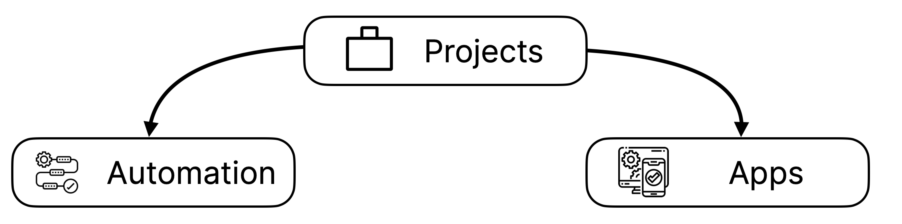
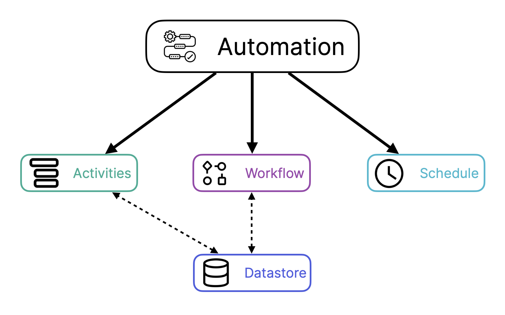
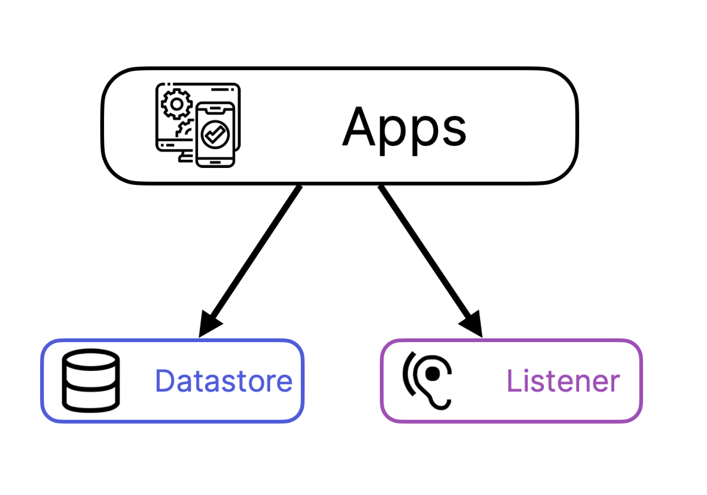

# Introduction to Toca

**Purpose:** An introduction to the toca platform and how it's structured.  

**Prerequisites:** No pre-requisites.

## Table of Contents

1. [What is Toca?](#what-is-toca)
2. [How is it structured?](#how-is-it-structured)
3. [What is possible with Toca?](#how-is-it-structured)
4. [What you will get from the 'Getting Started Guide'](#what-you-will-get-from-the-getting-started-guide)
5. [Toca Requirements](#toca-requirements)
    * [Toca Bots](#toca-bots)

## What is Toca?

Toca is a cloud-first, all-in-one Enterprise Automation Platform (EAP) which is split into four different products:

* Automation
* Apps
* Analytics
* Toca Development Kit (TDK)

Each product, whilst they stand on their own, integrates tightly with the other products in the platform to allow you to meet any business requirements.

This lets you automate and schedule business processes, build web applications, process data and extend the platform to fit your needs; all from a single web interface.

## How is it structured?

Both Automation and Apps are split into projects. A project is a collection of linked items; usually the items in a project will relate to a business area or be focused on a particular business process.

**Automation Projects** 

serve as dedicated workspaces for the creation and execution of automated workflows. Within each project, there are 4 key resources:

* **Activities**: within activities you will be able to create resuable components that can be assembled to automate or build workflows.
* **Workflows**: A Workflow consists of an orchestrated and repeatable pattern of activities. In Toca, the Workflow is the highest level of automation, it is the final stage where you put all your activities together to represent your business process. The workflow may be considered a view or representation of the real work.
* **Datastores**: Datastores are toca's persistent storage layer. You will be able to write to and from a Datastore as well as query using SQL syntax.
* **Schedules**: Schedules will allow you to set up when and how often your workflows can run.

Although tied to an individual user, a project can be created by anyone assigned the project role.

**App Projects** 

serve as dedicated workspaces designed for the creation, publishing, and management of apps. Each App project houses a single app, empowering users to craft pages, modify content, and regulate access permissions.

**Toca Development Kit**  

provides a realm to augment the capabilities of your Toca platform. Within the TDK, you can craft new actions for integration into automation projects, or develop fresh user interface (UI) components to enhance your apps.

## What is possible with Toca?

**Automation**: 

With Toca, transform business operations by designing activities and orchestrating them through workflows. Toca's automation simplifies intricate processes with a no-code, drag-and-drop interface, offering boundless integration potential across various software solutions. Schedule these activities to operate anytime—around the clock, every day of the year. All orchestrated activities are executed by virtual workers, termed **Bots**.

**Apps**:

With Toca, effortlessly craft multi-page web applications using intuitive drag-and-drop components. Integrate user authorization as needed and seamlessly link your Apps to automation projects, enabling the activation of automation workflows directly from your App. From simple blog-style sites to comprehensive web applications, Toca offers a flexible development landscape, all publishable with just a click. In fact, [toca.io](https://toca.io/) itself is a testament, constructed using Toca Apps!

**TDK**:

 Amplify the platform's capabilities by crafting or refining actions for Automation and components for Apps. The TDK empowers you to introduce functionalities tailored to your requirements, ensuring the platform always aligns with evolving needs. Moreover, enhancements made within the TDK are made accessible to all users on your platform.

## What you will get from the 'Getting Started Guide'

The Getting Started guide is designed to acquaint you with Toca's structure and help you embark on simple, yet practical projects. While Toca's intuitive design allows for rapid progress, we encourage you to delve deeper, step-by-step, to fully optimise your experience.

## Toca Requirements

Toca is a cloud-based Enterprise Automation Platform, it is designed to run in your browser on any modern full desktop operating system. The following browsers are supported:

* Chrome (for the best experience)
* Firefox
* Edge

Unfortunately, and potentially not surprising, Internet Explorer is not supported.

### Toca Bots

Bots are virtual workers that execute your apps and automation. One bot can execute a single task.
