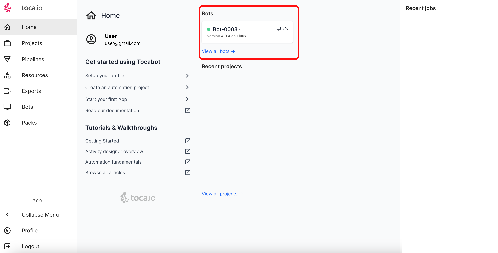

# Navigating Toca

**Purpose:** This section will guide you through Toca's user interface and outline the core components to facilitate a smooth start.
**Prerequisites:** Acces to Toca.

## Table of Contents

1. [The Home page](#the-home-page)
2. [The Profile page](#the-profile-page)
3. [The Project Page](#the-projects-page)
4. [The Pipeline Page](#the-pipelines-page)
5. [The Resources Page](#the-resources-page)
6. [The Exports Page](#the-exports-page)
7. [The Bots Page](#the-bots-page)
8. [The Packs Page](#the-packs-page)

## The Home Page

The first thing you see when you log in to Toca is your Homepage - An entry page filled with different widgets. Use these widgets to quickly navigate to the most important features and sections of Toca.

Your recently modified automation and app projects will appear here.

Your recent and currently running jobs.

The bots assigned to your user with their status.

## The Profile page

The Toca profile page allows you to change your name, contacct details and password.

You will also be able to change the colour theme of Toca. The defaul theme is the `DARK` theme.

for any changes to take place ensure you select the update profile button.

## The Projects Page

The projects page is where your Automation (processes/workflows) and Apps (Graphical User Interface/Front end) will be created and stored.

As you can see in the image above you will have your most recent projects displayed:

You also have both the automation section where you can create new automation projects as well as import projects from other Toca instances:

The Apps section contains the same as the automation section with the addition of the `New from template` option. As you build your Apps projects out you may want to create templates to ensure a common theme across all of your app products.

## The Pipelines Page

Pipelines is essentially a process log of your Automation and Apps processes.

As shown above, your executed processes are displayed. These processes are either manually initiated—commonly during the process-building phase—or triggered by an event or schedule.

On this page, you can delve into each process to inspect its outputs step by step. You also have direct access to the corresponding project and workflow. Additionally, you can delete the log, as highlighted in red in the subsequent image.

## The Resources Page

The resources page highlights all Datastores and Listeners. 

A Toca Datastore is essentially a SQL (Structured Query Language), it is where you can Create, Read, Update and Delete (CRUD) data throughout you Automation and Apps.

A Toca listener is essentially a [RESTFul API](https://en.wikipedia.org/wiki/Representational_state_transfer) service that connects your process together.

## The Exports Page

The exports page hosts any exported Automation and Apps that you may share with other Toca Projects.

## The Bots Page

The bots page contains all executation bots within your toca account and will display their state.

## The Packs Page

The Packs page holds pre-packaged Automation and Apps within your Toca instance. 