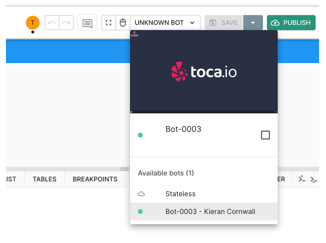
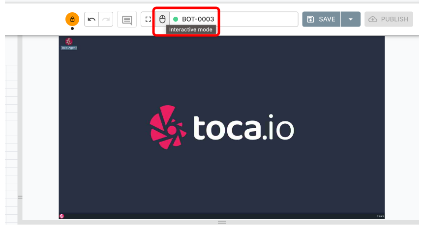

# Toca Bots

**Purpose:** Learn about how Toca bots work and this can benefit your implementation.  
**Prerequisites:** None

## Table of Contents

1. [Understanding Toca Bots](#understanding-toca-bots)
2. [What is a Stateful Bot?](#what-is-a-stateful-bot)
3. [Does It Matter Which Bot I Use?](#does-it-matter-which-bot-i-use)
    * [Use Cases for Stateful Bots](#use-cases-for-stateful-bots)
    * [Use Cases for Stateless Bots](#use-cases-for-stateless-bots)

## Understanding Toca Bots

Bots, in the context of automation platforms like Toca, are virtual workers designed to execute tasks autonomously, without human intervention. They play an essential role in automating repetitive and manual processes. Now, let's delve deeper into the types of bots and their unique characteristics.

## What is a Stateful Bot?

* ***Definition:*** A stateful bot retains memory of its interactions and operations. Think of it as a worker who keeps notes and remembers past tasks, using that information to influence future tasks.

* ***Location and Interaction:*** These bots are installed on a specific server or instance, allowing them to interact and execute tasks on that particular location.
Task Execution: Their operations are linked to the specific bot assigned. For example, if a task is designated to particular Bot, it will always run on that Bot unless manually changed.

From the image above, you'll notice an option to choose a specific stateful bot that's installed on a server.

After selecting the bot, you're empowered to:

* Initiate automation tasks on that particular bot.
* Directly engage with the system by clicking on the mouse icon adjacent to the bot.

* ***Use Cases:*** They are best suited for tasks that require continuity, like following a multi-step process over a period or interacting with GUI-based applications.

## What is a Stateless Bot?

* ***Definition:*** A stateless bot operates without retaining memory of past interactions. Imagine a worker who starts each task with a clean slate, uninfluenced by previous tasks.

When you choose a stateless bot, you'll observe that the GUI window is no longer present.

* ***Dynamic Operations:*** Due to their lack of memory retention, they can dynamically pick up and process tasks. This makes them incredibly efficient for tasks that are independent and don't require a historical context.

* ***Task Execution:*** Stateless bots prioritize efficiency. In platforms like Toca, when a task arises, it's automatically assigned to the least busy bot, ensuring tasks are executed promptly.

* ***Use Cases:*** They're ideal for standalone tasks, especially those that don't need a continuation from a previous state or context, like processing individual data items independently.

## Does It Matter Which Bot I Use?

When embarking on an automation journey, selecting the appropriate bot to optimise performance, resource usage, and the overall outcome. Here's why:

1. **Task Nature & Persistence**:
    * **Stateful Bots**: These bots retain memory or "state" of their interactions, making them suitable for tasks that require consistent interactions over extended periods. For instance, if a task involves multiple steps over time where the bot must remember previous actions, stateful bots excel.
    * **Stateless Bots**: These bots, on the other hand, don't retain any memory of past interactions. They're designed for short, repetitive tasks that don't require any retained memory from one execution to the next.

2. **Resource Efficiency**:
    * **Stateful Bots**: They often demand consistent resources as they maintain an active state. This can result in higher resource utilization if not managed well.
    * **Stateless Bots**: Because they reset after each task and don't retain memory, they are typically more efficient for quick tasks, ensuring you get the most out of your allocated resources.

3. **Flexibility & Scalability**:
    * **Stateful Bots**: They are bound to specific servers or instances, which may limit how and where they can be deployed or scaled.
    * **Stateless Bots**: These bots offer greater flexibility. Stateless activities are routed to the least busy bot, ensuring tasks are distributed efficiently.

4. **Error Handling & Recovery**:
    * **Stateful Bots**: If an error occurs, it's easier to resume from where the bot left off since it retains its state.
    * **Stateless Bots**: They start from scratch every time, so in case of interruptions, the entire process might need to be restarted.

5. **Intended Interaction**:
    * **Stateful Bots**: Since they can interact with specific servers or instances, they can be ideal for tasks that require direct interaction with particular systems.
    * **Stateless Bots**: They're designed for more generic tasks that don't hinge on interactions with specific server instances.

### Use Cases for Stateful Bots

Stateful bots remember previous interactions and states. They are like workers who recall past tasks, making them suitable for sequences of tasks that depend on prior actions.

* **Multi-Step Processes**:
  * **Description**: Tasks that require multiple steps over a period where each step depends on the outcome of the previous step.
  * **Example**: Processing loan applications where subsequent steps (like verifying documents, credit checking, and approval) depend on prior ones.

* **Interactive GUI Automation**:
  * **Description**: Tasks that interact with graphical user interfaces (GUIs) where prior context is needed.
  * **Example**: Automating tasks in a software like Adobe Photoshop where prior actions (like layer creation) influence future actions (like applying filters).

* **Long-Term Data Tracking**:
  * **Description**: Tasks that monitor data over a long duration and act based on previous data states.
  * **Example**: Inventory management systems that trigger restock orders based on past and current stock levels.

### Use Cases for Stateless Bots

Stateless bots operate without retaining memory of past interactions, making them apt for isolated tasks that don't require context or historical data.

* **Batch Data Processing**:
  * **Description**: Tasks that process large sets of data where each item is handled independently.
  * **Example**: Converting thousands of image files from JPEG to PNG format.

* **Real-time Request Handling**:
  * **Description**: Tasks that need to handle multiple real-time requests efficiently without any dependency on previous requests.
  * **Example**: Serving real-time currency conversion rates for a travel website.

* **One-Off Tasks**:
  * **Description**: Standalone tasks that have no relation to prior or subsequent tasks.
  * **Example**: Sending a single notification email or generating a one-time report.
