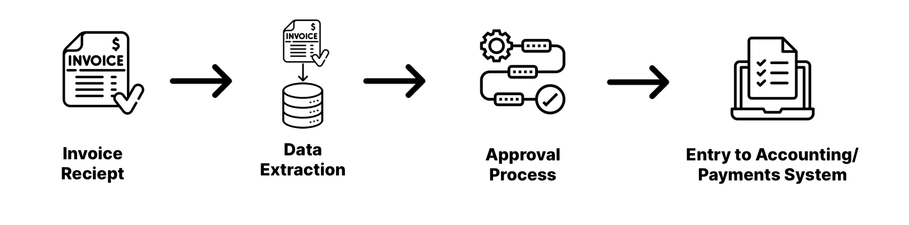

# Understanding Activities

**Purpose:** Understand how your business processes feed into toca automation.  
**Prerequisites:** None.

## Table of Contents

1. [Actvities](#activities)
2. [Decomposing Business Processes for Automation: Why It's Essential](#decomposing-business-processes-for-automation-why-its-essential)
3. [Invoice Processing example workflow](#invoice-processing-example-workflow)
    * [The workflow at a high level](#the-workflow-at-a-high-level)
4. 

## Activities

Think of Activities as the building blocks for your automation projects. Just like how LEGO pieces can be assembled to create larger structures, Activities are combined to form more complex patterns called Workflows.

To get the best out of Toca, it's a good idea to:

* Keep each Activity focused on a specific task or part of the process you're automating.
* Gradually build complexity by bringing multiple Activities together in a Workflow.

As you spend more time with Toca, you'll naturally find or develop your unique approach to assembling these Activities.

## Decomposing Business Processes for Automation: Why It's Essential

Breaking down business processes into smaller, manageable chunks is a fundamental step before diving into automation. Here's why:

* **Clarity and Understanding:** Segmenting complex processes helps teams grasp each component in detail, ensuring that no crucial steps are overlooked.

* **Precision in Automation:** With a clear structure, automating individual steps becomes more accurate. There's a reduced risk of errors which might arise from a more general, broad-strokes approach.

* **Flexibility and Scalability:** Smaller, well-defined tasks are easier to modify, expand, or integrate with other systems as business needs evolve.

* **Efficient Troubleshooting:** When something goes awry, having a segmented process makes it simpler to pinpoint issues and correct them without disrupting the entire system.

* **Performance Tracking:** By breaking down processes, businesses can more effectively measure and optimize each step, leading to overall performance improvement.

Remember, the goal isn't just to automate – it's to automate smartly. And that begins with understanding and decomposing your business processes.

## Invoice Processing example workflow

Many businesses have to manage the influx of invoices. Manual handling can be tedious, error-prone, and time-consuming. By automating this process using Toca, you can streamline operations, save time, and reduce errors.

### The workflow at a high level

The below image shows a simplified view of an invoce processing workflow:

1. **Invoice Receipt**

    ***Activity:*** Receive digital invoices via email or scan physical invoices to convert them into a digital format.

2. **Data Extraction**

    ***Activity:*** Extract key data points from the invoice using Optical Character Recognition (OCR) or predefined data extraction templates.

    Extracted data can include:
    * Vendor Name
    * Invoice Number
    * Date
    * Line Items
    * Total Amount, etc.

3. **Approval Process**

    ***Activity:*** Route the invoice to the appropriate department or individual for approval based on the amount or vendor.
    * Notify the approver via email.
    * Capture the approval or any comments.

4. **Entry to Accounting/Payments System**

    ***Activity:*** Update account/payments system to prepare and notify client of payment post authorisation.

## Streamlining Invoice Processing with Toca Automation

Processing invoices is a crucial yet time-intensive task for many businesses. Let's delve into how Toca can enhance and simplify each step of this process:

1. Invoice Receipt

    **With Toca**: Upon receiving a digital invoice, Toca can instantly notify relevant personnel, ensuring swift initial processing. For physical invoices, once they're scanned, Toca can seamlessly manage the digital files, categorizing and storing them systematically.

    ***Activity:***

    * **Digital Notification**: Immediate alerts for new digital invoices.
    * **Organized Storage**: Automatic categorization and storage of scanned invoices.

2. Data Extraction

    **With Toca**: Utilize Toca's integration capabilities with Optical Character Recognition (OCR) tools. Automate the extraction of key details from invoices, ensuring accuracy and eliminating manual data entry errors.

    ***Activity:***

    * **OCR Integration**: Automatic extraction of details like Vendor Name, Invoice Number, Date, Line Items, and Total Amount.
    * **Template-Based Extraction**: For recurring invoices from familiar sources, use predefined templates to capture details swiftly.

3. Approval Process

    **With Toca**: Rather than manual follow-ups, Toca can automate the routing process, sending the invoice to designated approvers based on set criteria like amount or vendor. Approvers are notified instantly, speeding up the approval phase.

    ***Activity:***

    * **Smart Routing**: Auto-route invoices based on predetermined criteria.
    * ***Instant Notifications**: Alert approvers immediately via email or other communication platforms.
    * ***Capture Feedback**: Securely record approvals, rejections, or any additional comments.

4. Entry to Accounting/Payments System

    **With Toca**: Integrate Toca with your accounting or payments system. Whether it's through direct API interfaces, browser automation, or other methods, ensure data is accurately updated without manual input.

    ***Activity:***

    * **Seamless Integration**: Directly update accounting systems through API interfaces or browser automations.
    * **Payment Notifications**: Automatically alert clients or finance teams post authorization, keeping everyone in the loop.

Toca’s automation capabilities not only expedite the invoice processing journey but also enhance accuracy, ensuring that every step, from receipt to payment, is efficiently managed.