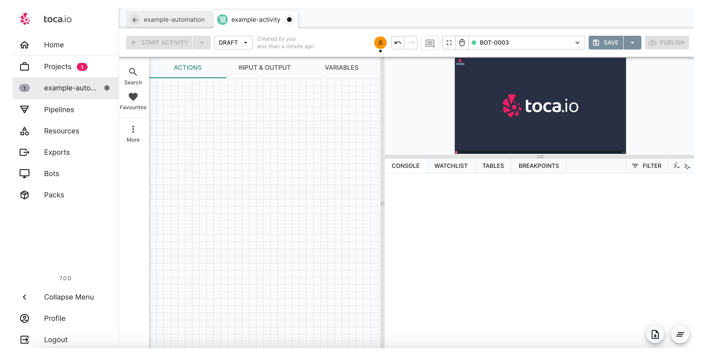
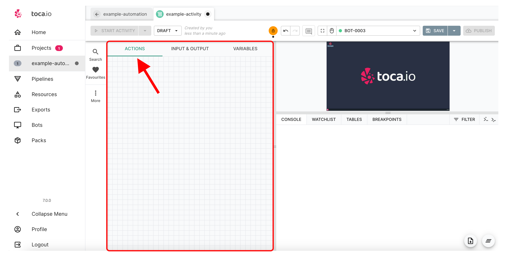
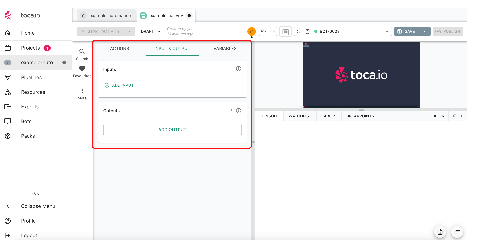
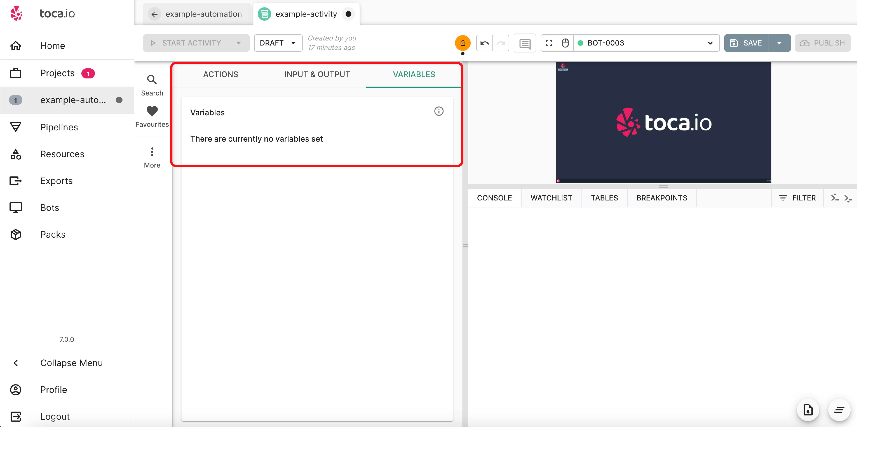
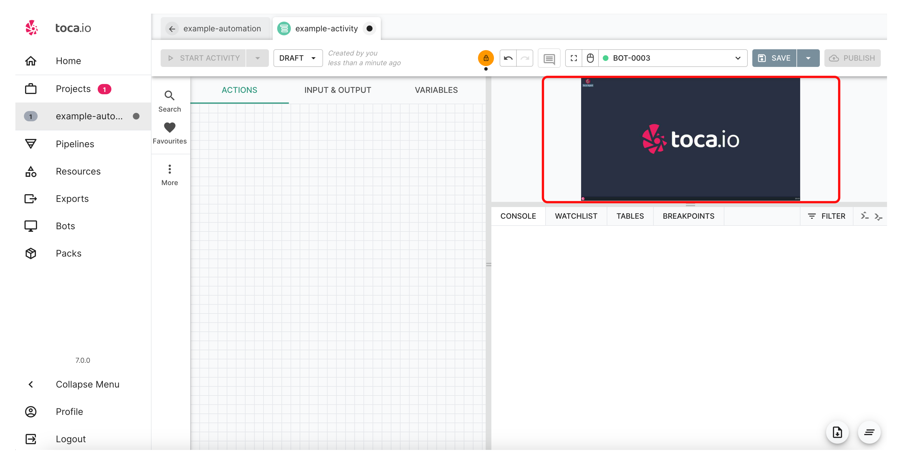
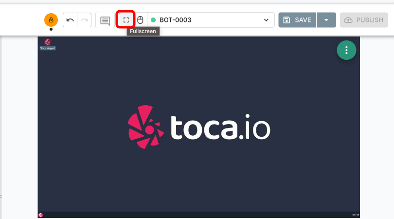
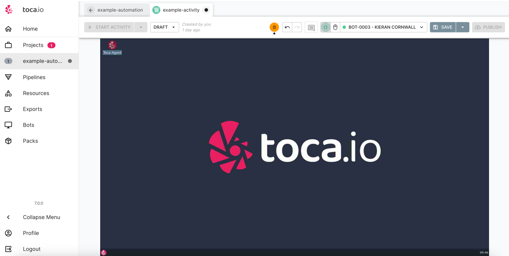
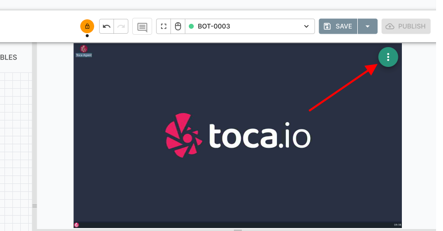
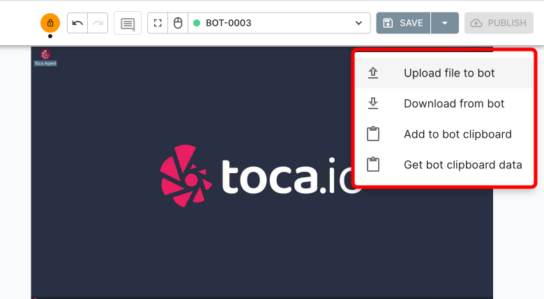
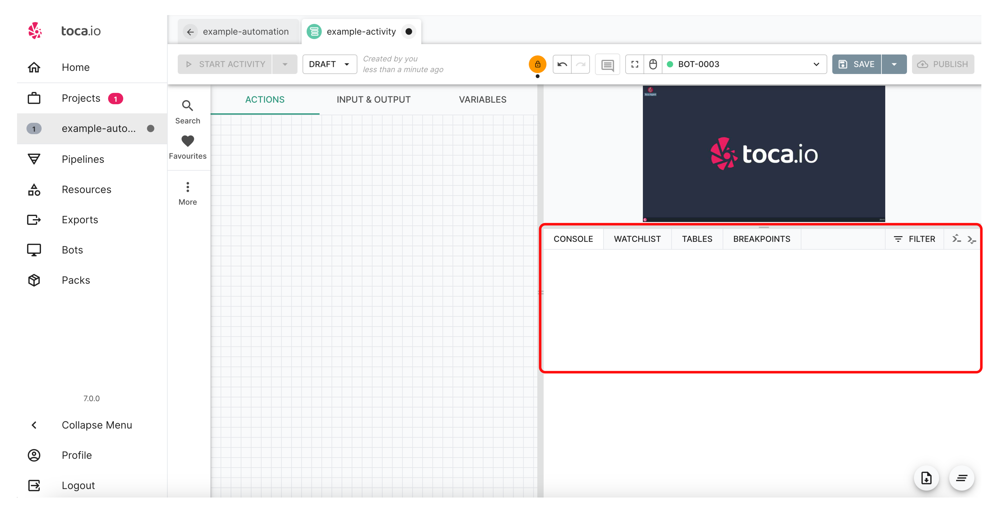

# The Activity Designer

**Purpose:** This section will explain the various sections of the activty designer and their use within building workflows
**Prerequisites:** An automation project should be set up and an activity created.

## Table of Contents

1. [Exploring the Activity Designer in Toca](#exploring-the-activity-designer-in-toca)
    * [Introducing the Activity Whiteboard](#introducing-the-activity-whiteboard)
        * [The Action Tab](#the-action-tab)
        * [The Input & Output Tab](#the-input--output-tab)
        * [The Variables Tab](#the-variables-tab)
        * [The bot window](#the-bot-window)
            * [A quick note on stateless and bots](#a-quick-note-on-stateless-and-bots)
        * [The Activity Console](#the-activity-console)
2. [Conclusion](#conclusion)
        

## Exploring the Activity Designer in Toca

Whenever you initiate or access an Activity, you're introduced to the Activity Designer. Think of this as your canvas or workspace, where you'll craft and refine your automation tasks. It's equipped with an array of tools designed to simplify and enhance even the most intricate processes.

The snapshot you see above represents an untouched Activity Designer – a blank slate waiting for actions, which we'll delve into in subsequent sections.

Join us as we navigate the nuances of the Activity Designer.

### Introducing the Activity Whiteboard

Highlighted in the image above, you'll find the **Activity Whiteboard**. This is your command center for structuring the automation of your business processes.

#### The Action Tab

By default, when you access the Activity Designer, you're presented with the **Action Tab**.

In this area, you'll place the necessary actions, effectively piecing together your automation.

#### The Input & Output Tab

The **Input & Output Tab** is crucial for data management. Here, you can add data inputs and expose data outputs for integration with workflows or for interfacing with a Toca `App`.

*Stay tuned; we'll delve deeper into this in subsequent sections.*

#### The Variables Tab

With the **Variables Tab**, you can seamlessly store and manage values pertinent to your business process across various actions.

*More details on this feature will be provided in the following sections.*

## The bot window

The bot window will show up when you have an active and allocated bot to your account.

An active bot may be installed on a windows or linux server and is there to receive instructions and run automation that you have created.

This is also where you can use interactive mode on the bot and interact with the operating system directly:

You can also select the full screen option make the desktop the focus:

When hovering over the bot screen you will see a menu icon appear:

By selecting this you will be able to download and upload. As well as working with clipboard.

### A quick note on stateless and bots

As you can see in the above image there is a stateful bot, if you need to refresh your knowledge on bots please head to the [Toca bots](https://github.com/tocalabs/user-guide/blob/rebuild-project/User_Guide/01-getting-started/03-toca-bots/toca-bots.md) section.

## The Activity Console

At the bottom of the Activity Designer; underneath the Bot screen you have the Console, Watch List, Tables and Breakpoints tabs. The console is a real-time log of every action that the Bot has run/is running and the Watch List allows you to view Variables and their values as an activity is running, more on this later sections.

When you run your activity you can see items added to the console in real time and it will show you that each action ran, when they ran and whether they were successful or not.

You can get more information about how each action ran by expanding the action's entry in the console.

You will see examples of this when we start to construct our first autoation in the subsequent sections.

## Conclusion

The Activity Designer in Toca provides a comprehensive and intuitive environment to craft, refine, and manage your automation tasks. With its diverse range of features, from the Action Tab to the Bot window, you're equipped with all the tools needed to build efficient and effective automations. The granularity of control, coupled with the ability to monitor activities in real-time, ensures that you're always in command of your processes. As we've seen, each tab and tool within the Activity Designer has a specific purpose, ensuring that each stage of your automation journey is streamlined and effective.

As we proceed to the subsequent sections, we'll delve deeper into the application of these tools, providing practical insights and examples to help you make the most of the Toca platform. Whether you're a seasoned automation expert or just beginning your journey, the Activity Designer is poised to be an invaluable asset in your automation toolkit.
