# Using an Action

**Purpose:** Review what actions are and some of the actions available to you in toca.
**Prerequisites:** a project already set up within toca and an activity added to review the actions available.

## Table of Contents

1. [Undersanding Actions in Toca](#understanding-actions-in-toca)
2. [Action Panel Overview](#action-panel-overview)
3. [Stateless and Stateful Bot Actions](#stateless-and-stateful-bot-actions)
4. [Adding an Action](#adding-an-action)
5. [Action Input Criteria](#action-input-criteria)
6. [Running an Action](#running-an-action)
    * [Run your Action](#run-your-action)
7. [Action Menu - Right Click](#action-menu---right-click)
8. [Reviewing Action Execution](#reviewing-action-execution)
9. [Summary](#summary)

## Understanding Actions in Toca

In Toca, **actions** serve as the foundational building blocks for your automation endeavors. Think of them as small, potent snippets of information. When combined in a specific sequence, they culminate into a broader, automated process.

## Action Panel Overview

The `Action Panel`, located on the left, is your toolbox. It houses all available actions you can deploy with your Bot.

In the first instance, you may find that all you can see is your searc, favourites and more as in the image below:

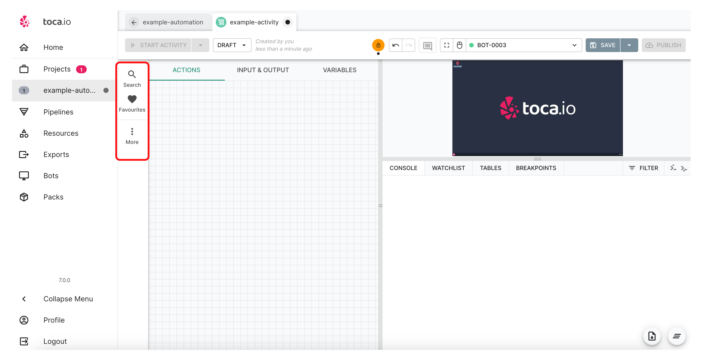

In your if you then click on the more menu a pop up will appear with all of the actions available to you to begin automating your business processes:

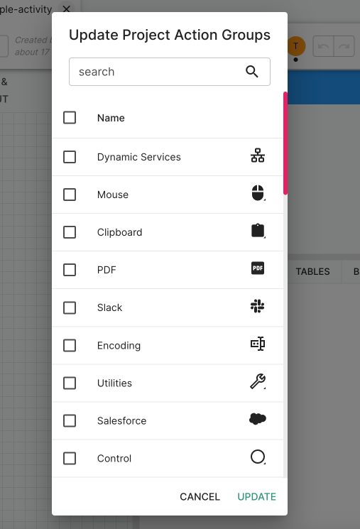

All you need to do is select what automation you wish to appear in your action panel to be used.

In the example below all have been selected:

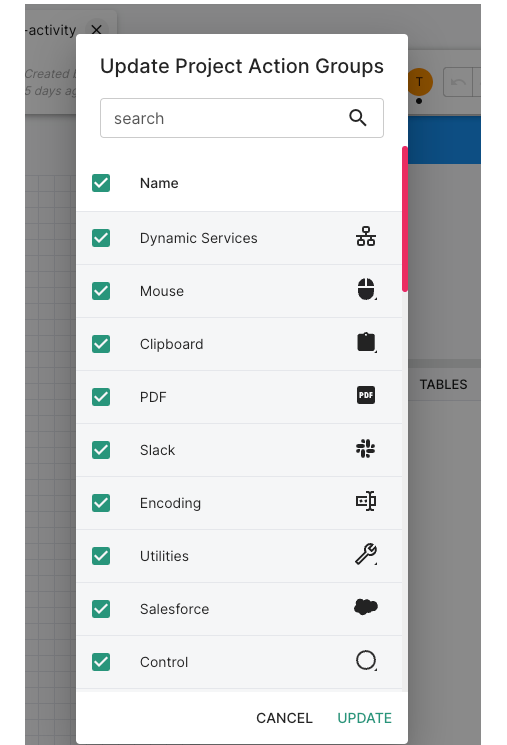

And once updated they will now appear in your actions panel:

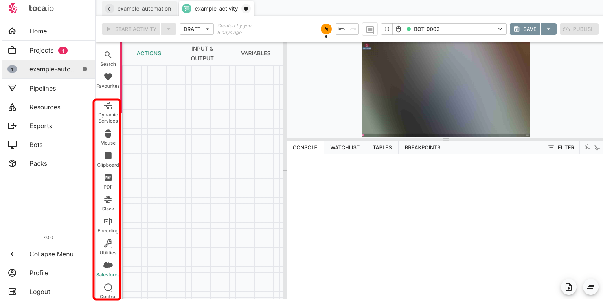

## Stateless and Stateful Bot Actions

It is important to know that some actions relate specifically to a '***Stateful Bot***' and some to a '***Stateless Bot***'.

You will see in the last image in the [Action Panel Overview](#action-panel-overview) We are using a `stateful bot` which gives us access to a GUI and in turn we have actions to operate on that `stateful bot` such as *Mouse click*, *Clipboard* and much more.

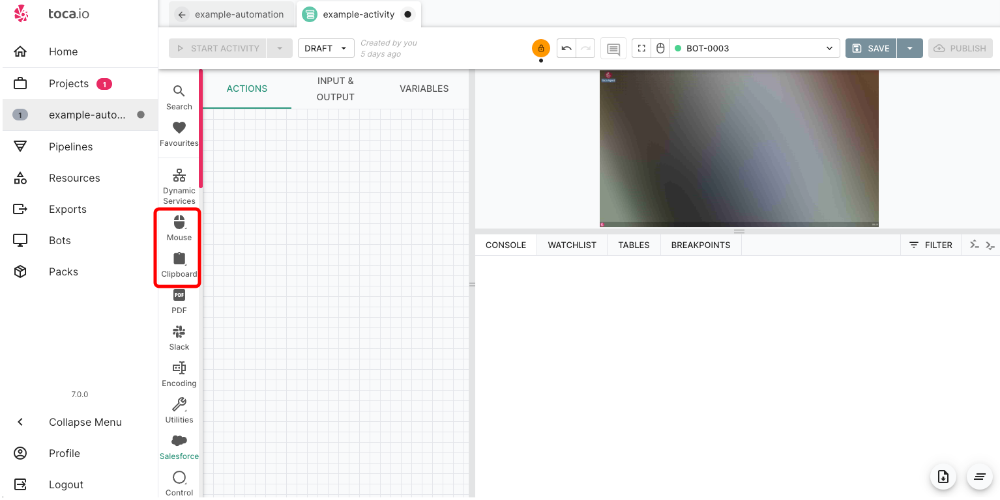.

If we then change our bot to a `stateless bot` those actions will be removed.

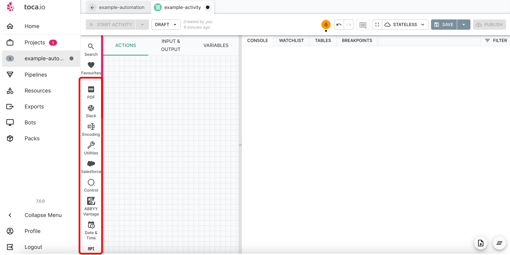

If you have `stateful bot` actions in your action panel and then switch to a `stateless bot` Those actions will be highlighted as an error and will not be able to run:

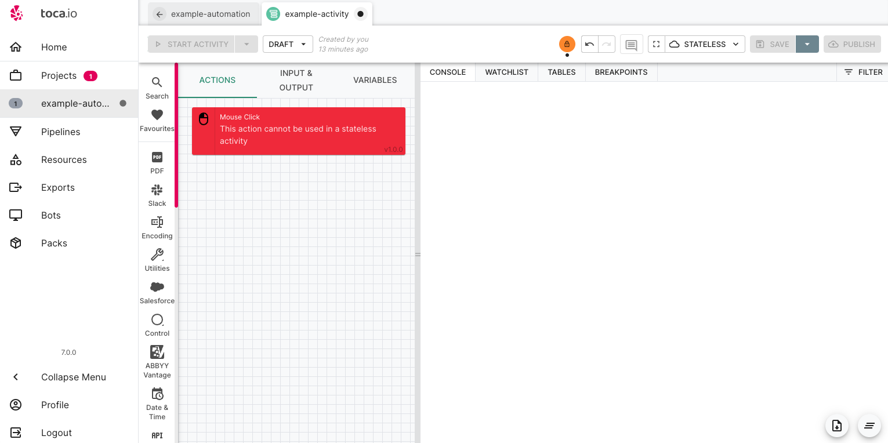

***NOTE*** - All `stateful bot's` can run any `stateless bot` action.

## Adding an action

Adding an action is straightforward. Just identify the action relevant to your business process, then click, select, and drag-and-drop as needed.

Some menus will create a sub option of further subsequent actions as below:

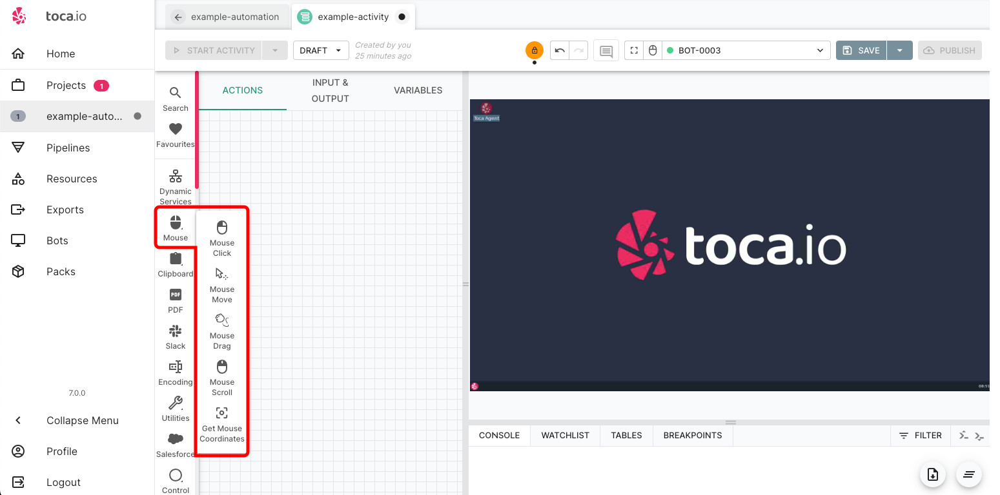

Again simply click or drag and drop to place that action on your menu.

## Action Input Criteria

When selecting most actions the input criteria or data needed to run the action will appear (below we are using the open browser action for a simple example):

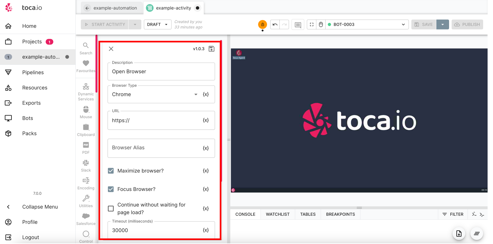

In the menu above, you can observe various data input options available, even for simple tasks like opening a browser. While many actions come with basic default settings, neglecting required fields will result in an error. To see this, try clicking the 'Save' button in the top right.

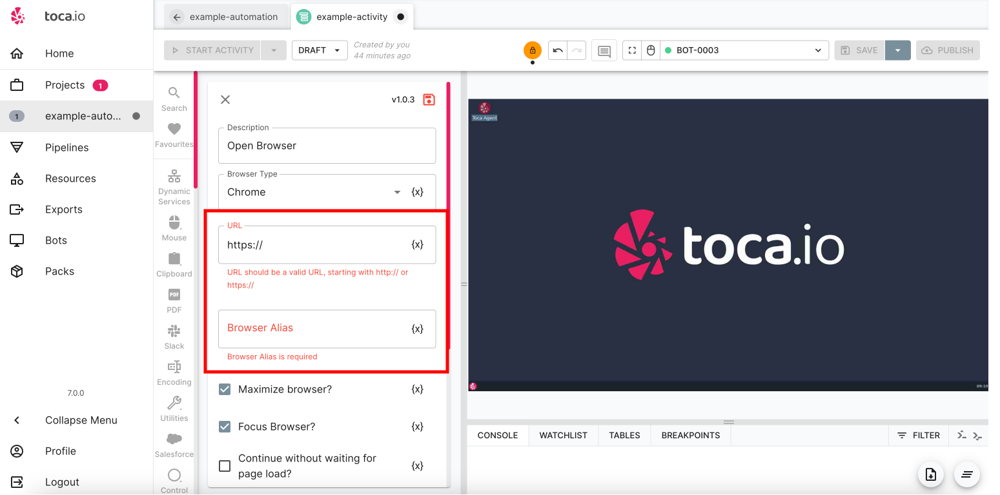

## Running an action

We will follow on directly from our previous example and input some data into our open browser action as below:

And now save the action by clicking the save icon in the top right of the screen:

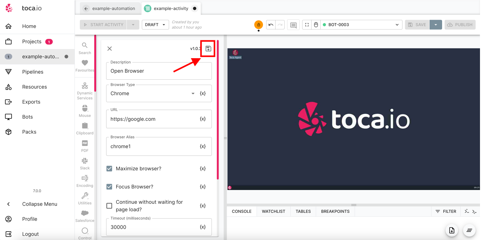

You will now see that your action is now in place on the action panel and ready to run!

But before we do, if you hover your mouse cursor over the action the 'action menu' will appear:

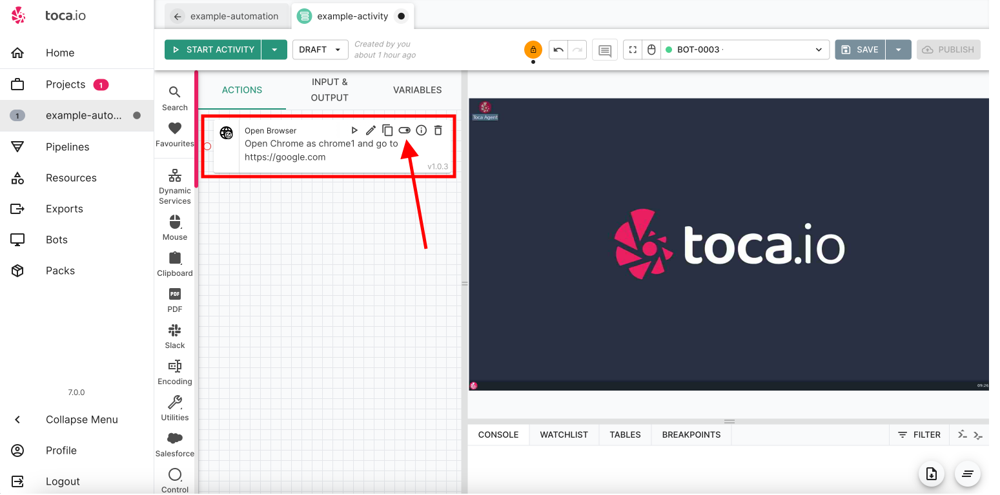

"As illustrated in the image above, there are six available action options:

* **Run Action** - Represented by the triangular play button. When clicked, it executes the individual action independently.
* **Edit Action** - Opens the Action menu, allowing you to modify details for the specific action.
* **Duplicate Action** - Creates a copy of your chosen action.
* **Disable Action** - As automation processes grow in complexity, there might be actions you don't currently need but don't want to delete. This option lets you toggle the action's active status.
* **Action Results** - Concerned with the output of your action, like whether it generates data. Selecting this displays all `data chips` for that action (we'll explore data chips further soon). See the example below:
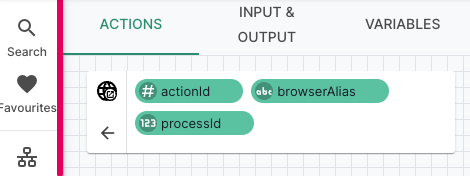
* **Remove Action** - Deletes the selected action."

### Run your action

You can run your action by clicking the run action button or the `start activity` button:

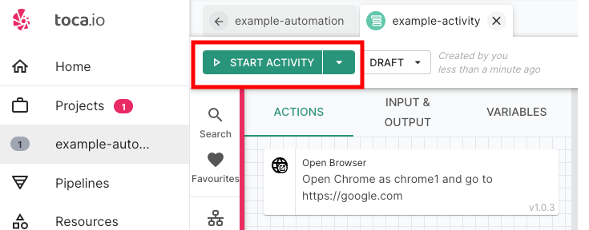

## Action Menu - Right Click

Right clicking on any action will bring up an action menu as below:

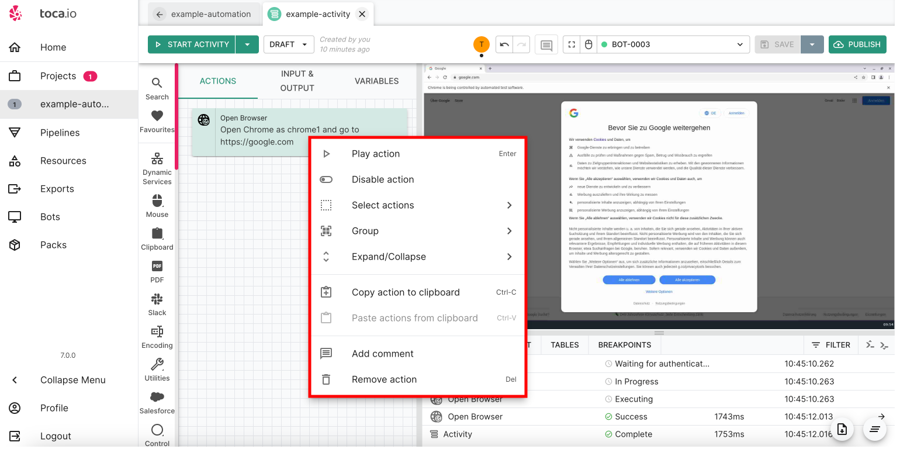

You can also right click to bring up a wider menu for your action, or a quick menu if you will.

## Reviewing Action Execution

Having executed an action within a `stateful bot`, we've now completed our inaugural automation run.

The action has initiated a browser with the intention of navigating to the `google.com` website.

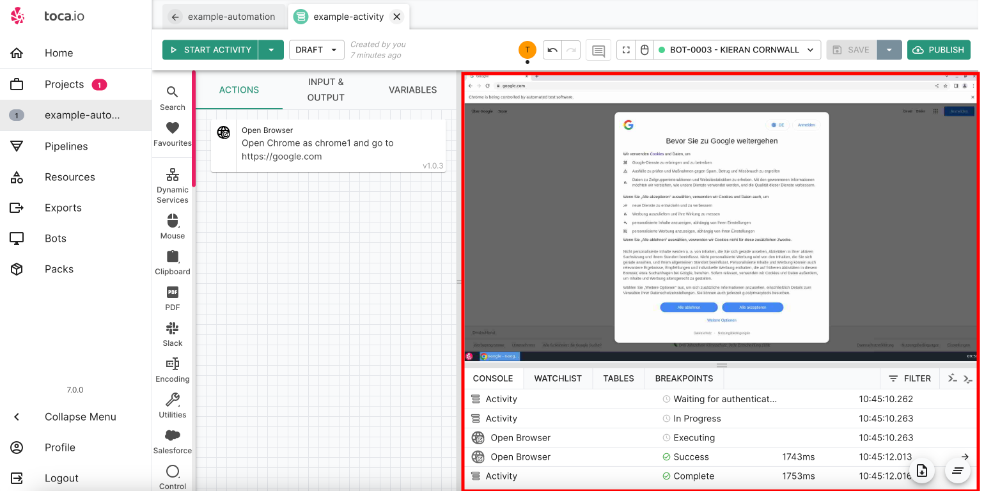

Additionally, the console window now captures the sequence of steps carried out by the action. These steps can be accessed for a more in-depth analysis of each individual action. We'll delve further into this shortly.

## Summary

Actions form the backbone of any automation process in Toca. They represent individual tasks or operations that, when pieced together, form a complete business process. In the following sections we will show how to bring together multiple actions to create a working process in our activity as well as manage data within particular steps.
