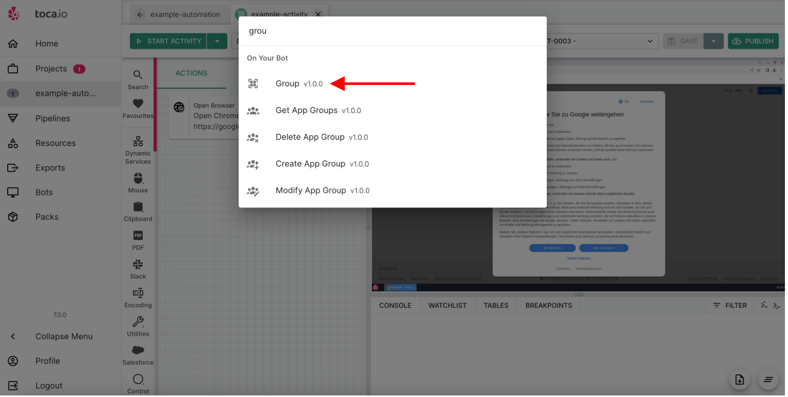
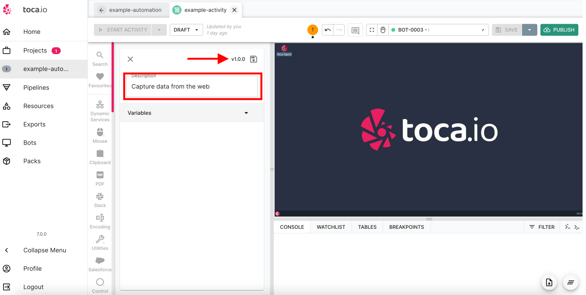
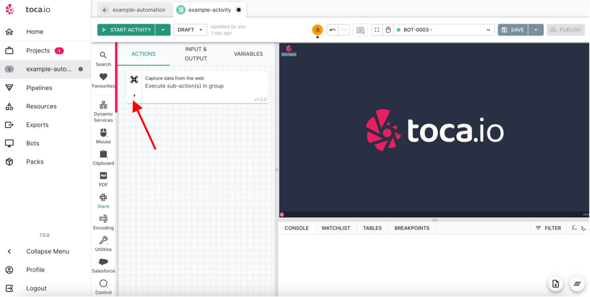
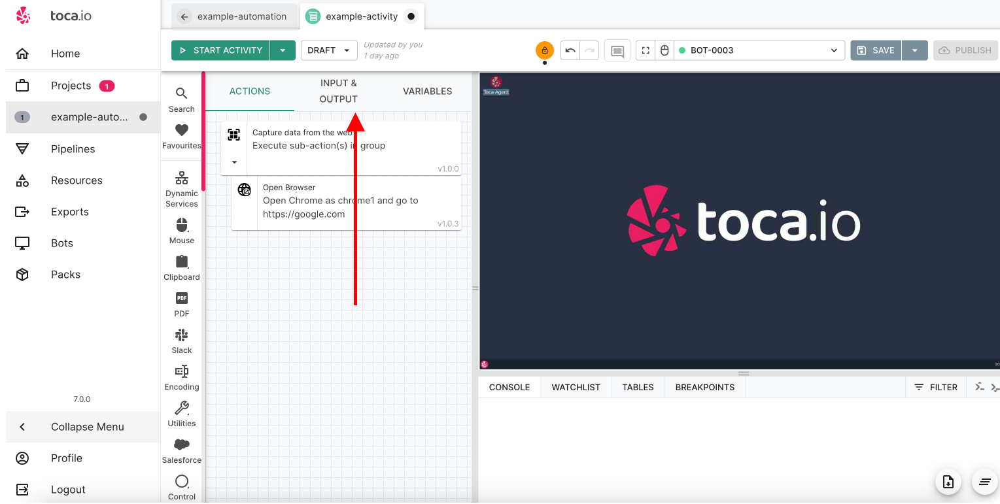
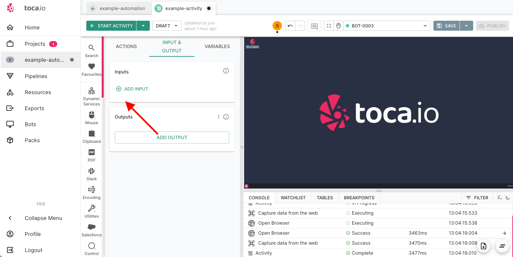
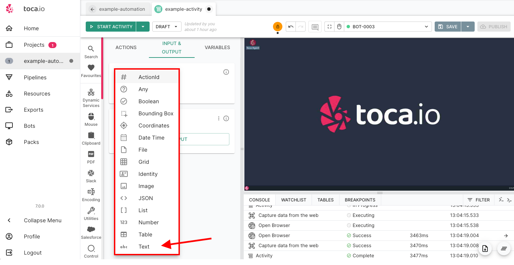
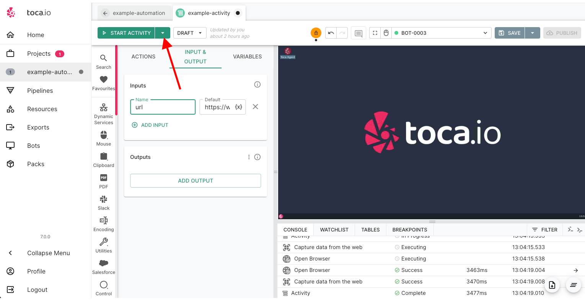
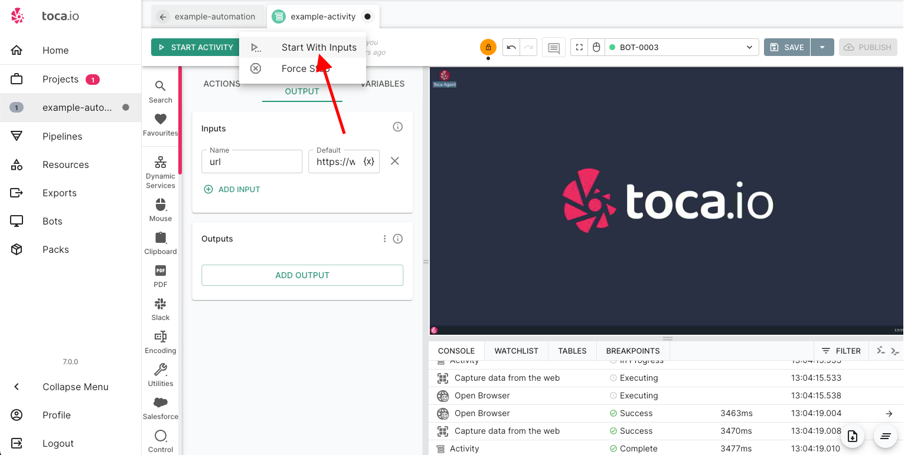
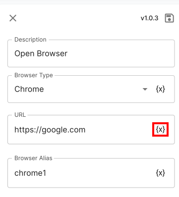
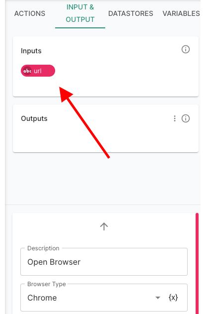

# Linking Actions to Form an Activity

**Purpose:** This lesson aims to provide insights into how to effectively link multiple actions together, thus creating a cohesive activity within Toca.  
**Prerequisites:** A basic understanding of individual actions within Toca and the concept of thinking functionally about these actions.

## Table of Contents

1. [Understanding Linked Actions](#understanding-linked-actions)
2. [Extending our open browser example](#extending-our-open-browser-example)

## Understanding Linked Actions

In Toca, while single actions represent specific tasks, the power of automation truly shines when multiple actions are linked together to form a comprehensive workflow, or what we call an "activity". Each action in this chain relies on the output of the preceding one, ensuring a seamless flow of data and tasks.

## Extending our open browser example

In the upcoming sections, we will delve deeper into enhancing our 'open browser' function and turn it into something repeatable and valuable by integrating key data principles and introducing new practices to optimally structure your activities and actions. Let's dive in!

### Grouping our actions

As we create more complex sequences of actions it makes sensse to group them together to help strucutre our wider activity.

Using the search bar we can quickly look for the group action:

Once selected we can create a meaningful name and the save:

Once we have saved our `group` action we will need to drag it above our `open browser` block and once we have we merely need to drag our `open browser` action into our group:

You should be able to see that our actions are now slightly nested:

Now we have a group that will contain our actions around capturing data from the web and ifwe then create more complex actions later on we can always clapse our web data capture to make things easier to view:

## Data inputs

We will be going into data management in actions in greater details in subsequent sections but we're going to imporve on our 'hard coded' browser open which was heading into `google.com`:

We want to change this so we can add an `argument` as highlighted in our [Functional Design Section](../00-thinking-functionally-designing-activities-with-purpose/thinking-functionaly-designing-activities-with-purpose.md).

To do this we must add an input by selecting and adding an input:

and then clicking the add input button:

You will see from the manu that appears there are a huge amount of options when adding inputs but we're interested in adding a text input:

This will bring up the following fields:

* **Name** - Clearly name your input
* **Default** - The default value is what will be used if no other value is provided.

We will add the details `name: url` and `Default: https://www.hl.co.uk/shares/stock-market-summary/ftse-100` as below:

***NOTE*** -> The default value can be overridden when passing a value from a workflow (which we will cover in subsequent sections) or by selecting the `Start Activity` drop down as below:

And selecting `Start with Inputs`:

Once selected the `Start with Inputs` option will bring up a menu with all available inputs available to you as well as being able to add new variables:

For this example we will not be changing our variable at start activity and it will not always be the case that you will want to change the input variable value.

## Updating an action to use an input variable

Now we have an inout variable set up we need to utilise that variable in our `open browser` action. We do this by selecting the `edit properties`:

We want to use our input variable and the default value it holds rather than manually input it ourselves. To do this we need to select the `variable` icon highlighted below:

After clicking the variable you will see the menu expand to show your actions as well as the various tab options, we need to select `INPUT & OUTPUT` which will display our first `datachip` which is our `url` input variable:

Now we have selected our new input variable `url`, if we now run our activity we should be able to see the browser hit our url destination:

### A quick note on datachips

Datachips are Toca's way of exposing data and as you can see, we had created an `inout variable` for our `url` which is now available for use across our `actvity`.

we will be going into more depth on `datachips` in the subsequent sections.

## Data Outputs

In the previous section we have created an open browser action and utilised an `input variable` to manage our default `url` as well as giving our activity the option of changing the variable.

We know want to take a look at how we create a data output from an action. 

