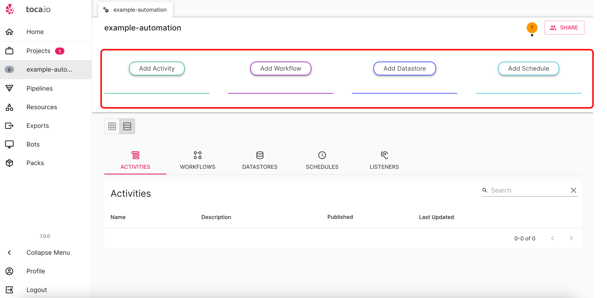
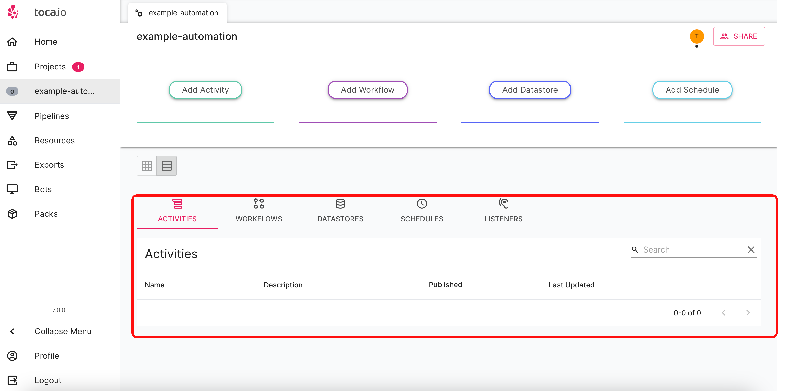

# Creating an automation project

**Purpose:** How to create an automation project and a breif intro to the sections that make up an automation.  
**Prerequisites:** No prerequisites needed.

## Table of Contents

* [Creating a new automation project](#creating-a-new-automation-project)
* [The automation landing page](#the-automation-landing-page)
  * [Activities](#activities)
  * [Workflows](#workflows)
  * [Datastores](#datastores)
  * [Schedules](#schedules)
  * [Listeners](#listeners)

## Creating a new automation project

Select the projects page and click the `New` button:

You will be met with the below menu that will expect a name and description of your project:

It's essential to give your automations clear names and provide descriptive explanations. As the number of projects and automations grows, this will make it easier to locate crucial projects when necessary.

## The automation landing page

When landing for the first time you will see the below landing page:

Automation projects are broken into four key areas:

### Activities

Activities are the foundational building blocks of your Automation projects. They serve as reusable units, enabling you to construct more intricate Workflows. It's recommended to design Activities to address specific segments of the business process you're automating. This approach allows for greater flexibility and scalability by layering and combining multiple Activities within a Workflow. While there are general best practices, your approach to constructing and combining Activities will evolve as you become more familiar with Toca, leading you to develop a style that aligns with your needs.

### Workflows

In Toca, a Workflow is a structured sequence of Activities, ensuring a consistent and repeatable pattern of business processes. Representing the pinnacle of automation within the platform, Workflows amalgamate various activities, effectively mirroring the overarching business process they're designed to emulate. By leveraging the Business Process Model and Notation (BPMN) [iconography](https://en.wikipedia.org/wiki/Business_Process_Model_and_Notation), Workflows serve as intuitive visual maps of your organizational procedures.

### Datastores

During automation, there may be occasions where you need to retain values for subsequent Workflow executions, necessitating a persistent data storage solution. While one could technically use files stored on the Bot, recording values post-workflow and retrieving them at the beginning, this isn't the most efficient or practical approach. Enter Datastores. These versatile storage containers simplify data retention. Whether it's files, images, variables, or even securely housing passwords, Datastores are designed to accommodate a wide array of content.

### Schedules

After crafting your workflow(s), the next step is determining their execution strategy. For workflows that are only needed sporadically, manual initiation via the 'Run Workflow' option in the Workflow Designer might suffice. However, most workflows benefit from routine and scheduled runs. With Toca, you can set up schedules for any Workflow, catering to even the most intricate timing requirements.

Some Automation can contain a multitude of all of the core components mentioned. Therefore there is a log section at the bottom of the Automation landing page to be able to quickly view various components.

### Listeners

You will see on the above image a section called `Listeners` Which we have not yet discussed. A listener transforms the start node of a Workflow into an externally accessible RESTful API endpoint. This enables integration of Toca Workflows into both your personal applications and third-party tools. We'll delve deeper into listeners and their capabilities later on.
