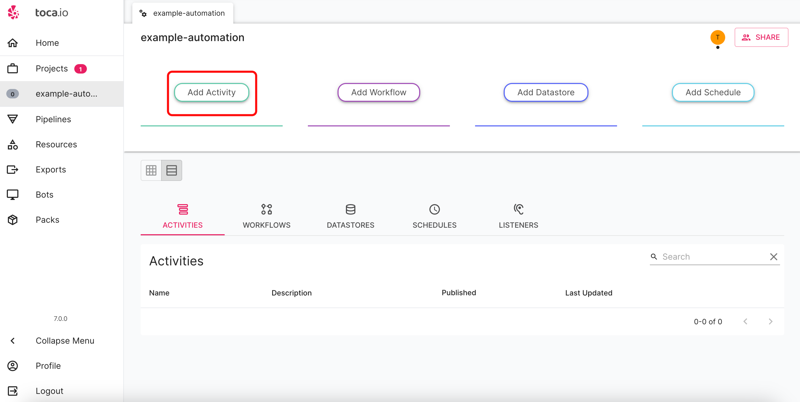
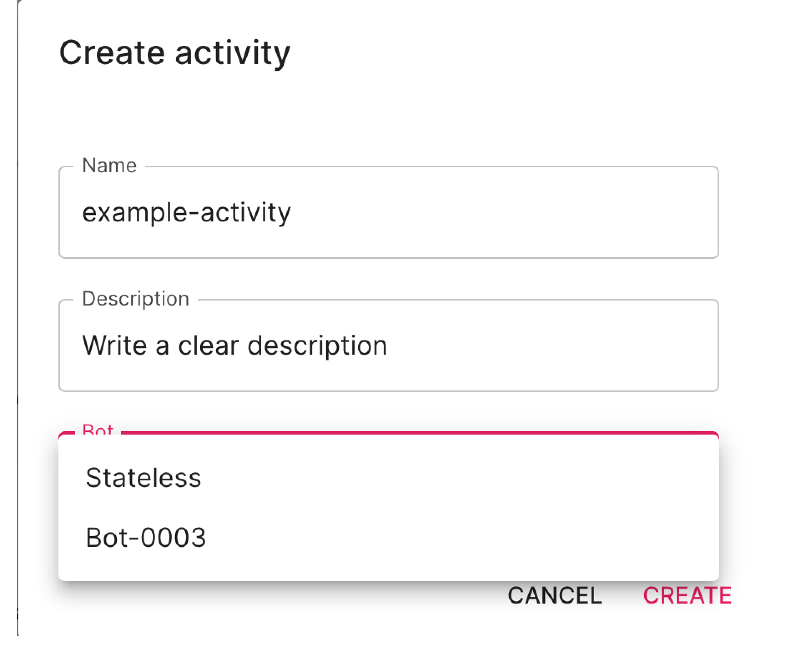

# Adding an Activity to your Automation Project

**Purpose:** An explanation on how to add an Activty to your project.
**Prerequisites:** A project already set up on toca.

## Table of Contents

1. [Adding an Activity](#adding-an-activity)

## Adding an Activity

Given you already have a project set up and you are on the project home page, select the `add activity` button as below:

You will see the following pop up appear:

As you can see there are three fields:

* ***Name*** - It is important to use names that will be descriptive of the particular activity. For instance, if you're automating a process to extract customer email addresses from an incoming form, a name like "EmailExtraction_Activity" would be both descriptive and easy to identify later on.

* ***Description*** - For every task you create, ensure you provide a clear description that succinctly outlines its primary function. This will not only help you quickly understand its purpose at a glance but will also assist other team members in deciphering its role without deep diving into its specifics.

* ***Bot*** - You have an option of Stateless and may have more that one bot to select from dependent on the number of bots you have purchase.

Simply click on "Create." This action will navigate you to the Activity Designer, which we'll delve into in the subsequent section.
