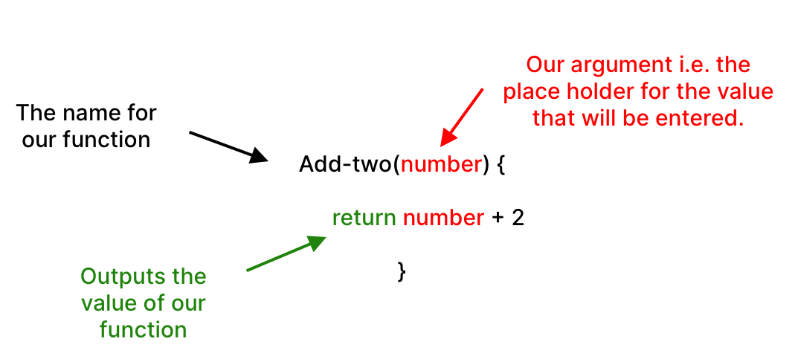
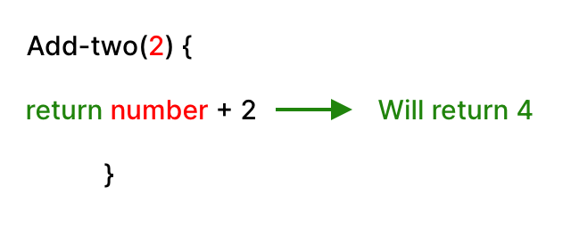
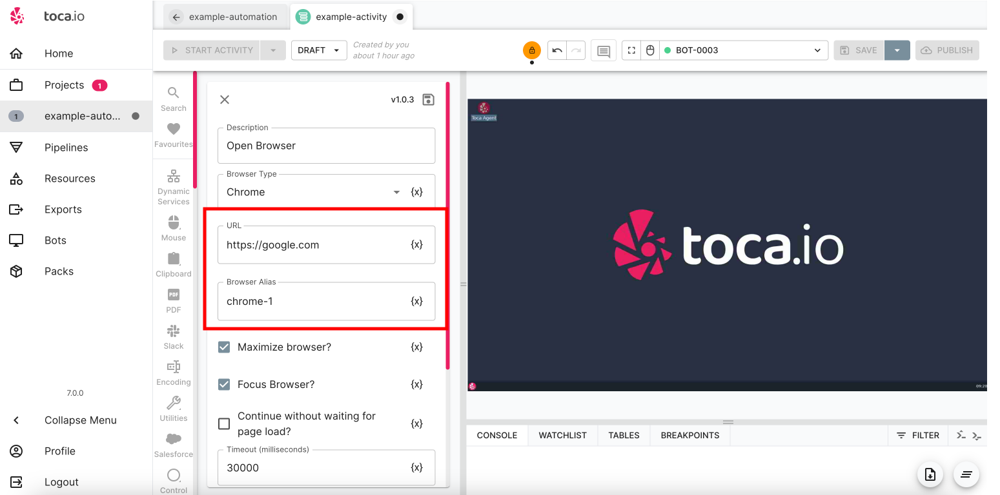
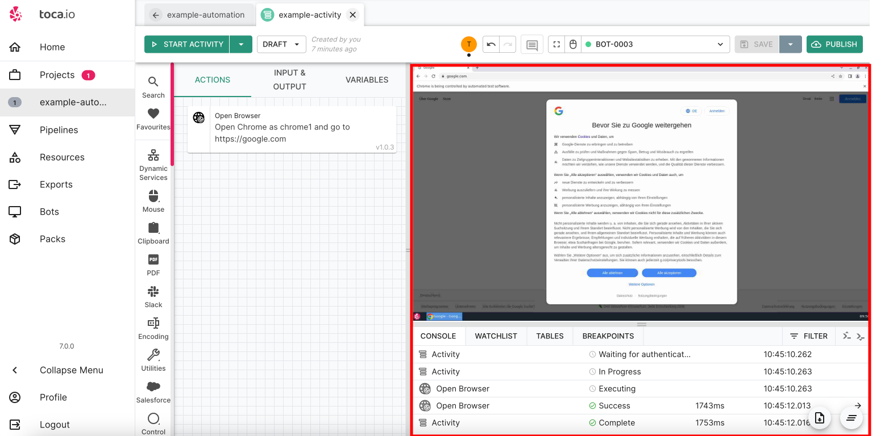

# Thinking Functionally: Designing Activities with Purpose

**Purpose:** This lesson aims to guide users in designing their activities in Toca by thinking of each action as a function, emphasizing a step-by-step process.  
**Prerequisites:** Basic knowledge of Toca's activity designer and understanding of automation concepts.

## Table of Contents

1. [Introduction to Functional Thinking](#introduction-to-functional-thinking)
2. [The Essence of a Function](#the-essence-of-a-function)
3. [Designing Actions as Functions](#designing-actions-as-functions)
4. [Practical Steps to Design Actions](#practical-steps-to-design-actions)
5. [Advantages of Thinking Functionally](#advantages-of-thinking-functionally)
6. [Conclusion and Next Steps](#conclusion-and-next-steps)

## Introduction to Functional Thinking

When designing activities in Toca, it's beneficial to approach each action with a functional mindset. This means seeing each action not just as a step, but as a function that has a defined purpose, input, process, and potential output.

## The Essence of a Function

At its core, a function:

* **Takes an Input**: This is the information or data the function needs to operate.
* **Processes the Input**: The function will have a defined set of operations it performs.
* **Produces an Output (sometimes)**: Not all functions will have a visible output, but they might alter data or produce results used in subsequent steps.

For instance, imagine a simple mathmatic function that simply adds 2 to any number given:

* **Function Name** - We need to clearly name our function/
* **We provide an argument** - An argument is a value that we will pass the function to complete its internal ation.
* **The return/output** - The function (action) will complete the work necessary and then provide the output as a data value.

## Designing Actions as Functions

In Toca, every action you design can be conceptualised as a function. Here's a simple example of what we had completed in our previous section when opening a browser:

* **Action**: Open a Web Browser
  * **Input**: The URL you want to navigate to and the browser alias name:
  
    * **Process**: The action of launching and navigating the browser.
    * **Output**: The loaded web page:
    

By thinking functionally, you ensure that:

1. Every action has a clear purpose.
2. Inputs and outputs (if any) are well-defined.
3. The process within the function (or action) is streamlined and efficient.

## Practical Steps to Design Actions

1. **Define the Purpose**: Before adding an action, be clear on its role in the overall activity.
2. **Identify the Inputs**: What does this action need to operate? It could be data, a previous action's output, or user input.
3. **Outline the Process**: Understand what the action does. This might be straightforward for simple actions like "Click" but may require more consideration for complex ones.
4. **Determine Potential Outputs**: Does this action produce data or results that will be used later? If so, make a note of it.

By following these steps for each action, you not only build efficient automations but also make them easier to troubleshoot and scale.

## Advantages of Thinking Functionally

1. **Clarity**: Each action has a clear and defined purpose.
2. **Efficiency**: With well-defined inputs and outputs, you reduce redundancies and errors.
3. **Scalability**: Functional designs are modular, making it easier to expand or modify the activity.
4. **Troubleshooting**: When an issue arises, it's simpler to pinpoint the problematic function and rectify it.

## Conclusion and Next Steps

Thinking of each action as a function paves the way for purpose-driven, efficient, and scalable automation designs. As you progress in your Toca journey, this mindset will be invaluable in constructing intricate activities that run seamlessly.

In subsequent sections, we'll delve deeper into advanced functional design strategies and explore real-world examples.
