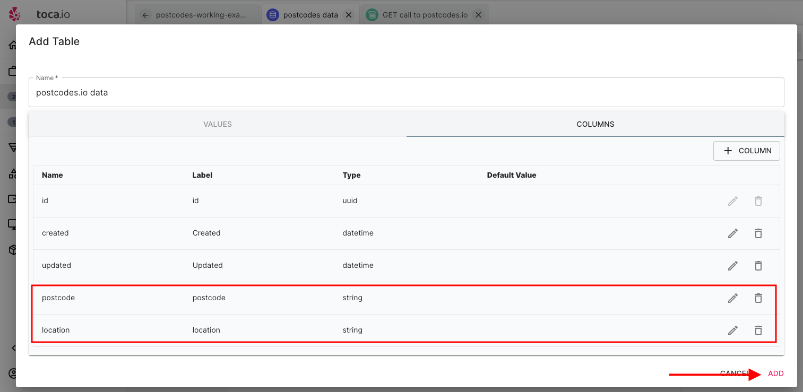

# Making API POST Calls and Managing Iterated Data

**Purpose:** The aim of this section is to show how to make API POST calls to a service as well as handle large JSON responses, iterating through them and adding into a Datastore for future use.

**Prerequisites:** RESTful API understanding, use of Toca actions, awareness of datastores, JSON and acess to Toca.

## Table of Contents

1. [Pre-requisites](#pre-requisites)
2. [Getting Started](#getting-started)
3. [Creating our Base URL](#creating-our-base-url)
4. [Allowing for multiple postcodes](#allowing-for-multiple-postcodes)
5. [Preparing POST body for API call](#preparing-post-body-for-api-call)
6. [Creating our POST API Call](#creating-our-post-api-call)
7. [Testing our call](#testing-our-call)
8. [Data Storage](#data-storage)
   1. [Creating Our Datastore and Table](#creating-our-datastore-and-table)
9. [Navigating our JSON response](#navigating-our-json-response)
10. [Selecting our JSON data](#selecting-our-json-data)
11. [Repeat for our Admin District data](#repeat-for-our-admin-district-data)
12. [Adding Our Data to Our Datastore](#adding-our-data-to-our-datastore)
13. [Testing our final output](#testing-our-final-output)
14. [Conclusion](#conclusion)

## Pre-requisites

As part of this section we will be utilising a service calle [postcodes.io](https://postcodes.io/) which is an open source API. Postcodes.io allows UK postcode data to be queried over a JSON HTTP API.

Please note that as part of this guide:

- The Automation project has already been setup.
- The creation of an `activity` has already taken place.
- The focus will be on the `actions` and `Datastore` management to deal with requested and response data.
- All information regarding the service used can be found in the README.md at the root of the `making-API-calls` folder and we will be assuming this has been reviewed.

What will be covered:

- Making API POST calls
- iterating through JSON data
- Extracting data from JSON
- Datastore creation and management
- Writing a row to a Datastore
- Using Inputs, Outputs and Variables

*Getting Started*


As you can see in the image above we already have a project started and have selected some of the actions we will need. Also, we will be using a Stateless Bot as we do not need any interaction with any apps or screens.

## Creating our Base URL

An integral part of effective automation management is the practice of abstraction and data injection whenever possible. The required URL is as below:

- `https://api.postcodes.io/postcodes/`

As this is a `POST` API call we will need to provide a JSON body in the message which we will dive into later in this guide.

In this practical example, we will employ an `INPUT` to define our base URL and establish a default value. The primary reason for choosing this approach is to maintain a straightforward workflow. If you find the need for multiple 'environment variables,' it is advisable to consider using a Datastore.

we will need to create an input variable for our base URL adn begin selecting `INPUT & OUTPUT` new and select text as below:


We will then add our Varible name as `baseURL` and the default value will be `https://api.postcodes.io/postcodes`:


## Allowing for multiple postcodes

We will create another variable that will take an INPUT when running our activity.

So, we will create another variable but without a default to allow inputing the postcode by running our Activity with `Start With Inputs`.

Again this will be a `Text` Input called `postcode-list`:


More on how we apply the multiple next.

## Preparing POST body for API call 

As part of the `postcodes.io` POST service you are able to send in a POST body of JSON in the below format:

```JSON
{
  "postcodes" : ["SW1A 2AA", "M45 6GN", "EX165BL"]
}
```

When we use our input variable of `postcode-list` with a list -> `["SW1A 2AA", "M45 6GN", "EX165BL"]` We need to be able to combine it to create our JSON body for our API call POST message.

We will need to access a `Set Variable` action:


We will need to update the first three fields:


1. Write a clear description
2. Name our variable `JSONPOSTBody`
3. Select JSON from the `Variable Type` drop down

Now we need to select the `insert datachip` button highlighted below:


And then select our `postcode-list` datachip:


Once this is in place we need to ensure that our JSON body variable matches the JSON below exactly:

```JSON
{
  "postcodes" : <datachip here>
}
```

You will see that our datachip is surrounded by `$$ $$` which injects our `postcode-list` variable into our JSON.


Lastly, if you check the bottom of our `Set Variable` you should see that our output Variable is already set:


Let's now save our variable and prep our POST call.

## Creating our POST API Call

First we need to select our `API Caller`:


The first things we need to do are:

1. Add a good description
2. select our transport layer as `HTTP`
3. set our method to `POST`
4. Set our body to `Text`


Next we want to add our base URL from our variables by selecting the `{x}` symbol next to the URL field, selecting the Variables tab and selecting our baseURL datachip:


Next, we need to do the same for the body field of our message by selecting the `{x}` symbol next to the `Body` field, head to our Vairbales and selecting our `JSONPOSTBody` datachip:


Lastly, we want to handle the repsonse of the call i.e. set our output (JSON) to a variable to extract data from later.

We need to scroll to the bottom of our `API Caller` and select the variables drop down. You will see:

- `result` - in our instance it will relate to the JSON repsonse from our call to poscodes.io.
- `statusCode` - These will be HTTP status response codes such as `200`, `404`. etc.
- `headers` - does exactly what it says and returns all headers from our call.

click the plus next to the `result` and name the variable `multiPostcodeResponse`:


All we now need to do is save our `API Caller` and move on to test our call.

## Testing our call

ok, let's begin by selecting the drop down next to our `Start Activity` and select `Start With Inputs`:


Then add the below list to the `postcode-list` variable:

`["SW1A 2AA", "M45 6GN", "EX165BL"]`


Then click start activity

Now we should see that our console is showing each step and we should be able to select our successful API call to view the JSON response:


Before we look on how we will navigate and parse our data we will need to set up our storage.

## Data Storage

Effective data management is crucial in any process, and we will be creating a `Datastore` to store data components from the captured JSON. This will enable us to use the data at a later date and make necessary changes as needed.

### Creating Our Datastore and Table

Within our core project, follow these steps to add a Datastore:

1. Select `Add Datastore`:

   

2. As you type the label, the name will automatically match:

   

3. After adding the Datastore, we need to create a table within it to hold specific data in the form of columns for future use.

   

4. By default, you will see three columns: `ID`, `created`, and `updated`, which are automatically populated, similar to many databases.

   

5. Make sure to provide a name for the table before adding columns for the specific data you intend to capture.

   

6. Next, add a column to capture both the `postcode` and `admin_district` from our response. Here's an example of adding a `postcode` column with the data type set as string:

   

7. Repeat the same process but use `location` as the name of the column.

8. Once you've completed adding the necessary columns, you will see them in place. Finally, add (press the add button) the table to your Datastore:

   


## Navigating our JSON response

As we are requesting multiple postcodes the response is returning an array/list of objects to work with:

```JSON
{
    "status": 200,
    "result": [
        { first object},
        { Second Object}
        ]
}
```

Here is a real example of the response"

```JSON
{"status":200,"result":[{"query":"SW1A 2AA","result":{"postcode":"SW1A 2AA","quality":1,"eastings":530047,"northings":179951,"country":"England","nhs_ha":"London","longitude":-0.127695,"latitude":51.50354,"european_electoral_region":"London","primary_care_trust":"Westminster","region":"London","lsoa":"Westminster 018C","msoa":"Westminster 018","incode":"2AA","outcode":"SW1A","parliamentary_constituency":"Cities of London and Westminster","admin_district":"Westminster","parish":"Westminster, unparished area","admin_county":null,"date_of_introduction":"198001","admin_ward":"St James's","ced":null,"ccg":"NHS North West London","nuts":"Westminster","pfa":"Metropolitan Police","codes":{"admin_district":"E09000033","admin_county":"E99999999"
// More data follows
```

We need to extract the results and then loop through each object to grab the data we want. Our aim is to capture `postcode` and `admin_district`.

Toca has an object to help us iterate through JSON data and then pull out what we need. So, let's get started.

First we need to select our `for each JSON object`:


And then select our repsonse datachip from our API call by selecting the insert datachip:


and then select our `multiPostcodeResponse` datachip:


Next we will have to utilise JSON path to access the particular data set we need to loop through but before we do.

---

### Understanding JSON Path

To access JSON data Toca uses JSON path which ais a simple programitical way to access layers of JSON data.

Let's say you have the following JSON data representing a list of books:

```json
{
  "library": {
    "books": [
      {
        "title": "The Great Gatsby",
        "author": "F. Scott Fitzgerald"
      },
      {
        "title": "To Kill a Mockingbird",
        "author": "Harper Lee"
      },
      {
        "title": "1984",
        "author": "George Orwell"
      }
    ]
  }
}
```

Now, let's say you want to extract the titles of all the books in the "library" using JSONPath.

The JSONPath expression for this would be:

``` text
$.library.books[*].title
```

Here's how it works:

- `$.` indicates the root of the JSON object.
- `library` is the key to access the "library" object.
- `books` is an array within the "library" object.
- `[*]` selects all elements in the "books" array.
- `title` is the key to extract the "title" value from each book.

So, when you apply this JSONPath expression to the JSON data, you will get the following result:

``` python
[
  "The Great Gatsby",
  "To Kill a Mockingbird",
  "1984"
]
```

This result includes the titles of all the books in the "library" as requested. JSONPath is a powerful tool for querying and extracting specific data from JSON structures.

---

Now, we will be using the following JSON path:


The JSON path of `$.result` chages our JSON from being the below structure:

```JSON
{"status":200,"result":[{"query":"SW1A 2AA","result":{"postcode":"SW1A 2AA","quality":1,"eastings":530047,
// More data follows
```

To being the value of the array allowing the iteration object to loop through each individual JSON object in the result.

```JSON
{[{"query":"SW1A 2AA","result":{"postcode":"SW1A 2AA","quality":1,"eastings":530047,
// More data follows
```

lastly, save our JSON iterator.

---

### Using a Debug Value to test

Our JSON iterator will only work with a `child action` i.e. some kind of action that the JSON iterator can output to.

We are going to use a `Debug Value` action. Use the search bar and tyoe in `debug` and the first thing that should appear is our `Debug Value` action.

No need to worry about renaming anything at the moment, we're simply going to use the debugger to show the output for our JSON iterator.

What we do need to do is select an `output` for our debugger. So, select the `{x}` icon next to the debugger, we then need to select our JSON iterable and you should see the below:


As you will see in the above image there is a green data chip called `currentJson`, a green data chip means it is an `action` data chip. 

We have been using a lot of red data chips that relate to Variables and it's important to note that variables are applied when we want to use or change something later.

An Action (green) datachip is available within that action and is there to be utilised as part of another process i.e. we are not storing it for later, we can use the data chip 'in process'.

Let's select the `currentJson` datachip and save our debugger.

Now, our JSON iterable needs a child action to operate and therefore we need to drag our `Debug Value` under our JSON iterable much like in the image below:

\

You should see a small gap as in the image above.

If we now run our activity with the input of `["SW1A 2AA", "M45 6GN", "EX165BL"]` and select one of the debug values we should now see our individual JSON object exposed.


---

## Selecting our JSON data

We have a working call to the `postcodes.io` service, and data is being returned in the following JSON format:

```JSON
{[{"query":"SW1A 2AA","result":{"postcode":"SW1A 2AA","quality":1,"eastings":530047,
// More data follows
```

We are interested in capturing two data points from the results section: `postcode` (e.g., `SW1A 2AA`) and `admin_district` (e.g., `Westminster`) in this example - although we have three postcodes as part of our iterable.

Before proceeding, let's quickly run our Activity with the input of `sw1a2aa` and execute it, so we have some data in the console - the reason for this will become clear later when Toca exposes some log data:


Now that we have a console-logged run, let's add our JSON Navigator action byt clicking on the JSON action in the menu and selecting `JSON Navigator`.

Once selected update as below:


1. input a viable description
2. select `select one` from the drop down


Under our `JSON` field select the `{x}` icon, then click our JSON iterable and select `current JSON` similar to our work with the `Debug Value`.

Lastly, we need to set our JSON Path within the `JSON Query` field

```JSON
{[{"query":"SW1A 2AA","result":{"postcode":"SW1A 2AA","quality":1,"eastings":530047,
// More data follows
```

We need to use `$.result.postcode` to access our postcode.

It should look similar to the image below:


Lastly, we need to create an output variable called `postcodeCapture`:


Lastly, save our JSON Navigator action and **IMPORTANT** - ensure the action is under the JSON Iterable.

If we then run our activity as we have previously we should now be able to see our output in the console:


### Repeat for our Admin District data

We now need to follow exactly the same principles for to capture our `admin-district` as we did in our previous capture, following the same process and ensure the data is input as in the corresponding images:


Add the variable:


Save, ensure the action is under our JSON iterable and run:


## Adding Our Data to Our Datastore

Last but not least, now that we are confident we have gathered our data, the final step is to store it in the table within our Datastore that we created earlier.

Select the `Tables` action, followed by `Maipulation` and then select `add row to table`:


Next we need to select the `{x}` next our table the select `Datastore` tab from the top of the screen and then select our postcode data table:


Once selected we should see our data expected as below:


We now need to select the `{x}` icon on our postcode data, hed to our `variables` tab and select our `postcodeCapture` variable:


And then repeat the same for our `admin_district`:


Lastly, save our `Add row to table` action.

## Testing our final output

We will now run the start activity with our list -> `["SW1A 2AA", "M45 6GN", "EX165BL"]` as we have previously.

We should now see our add row to table in our console as below:


Now if we head to our datastore:


click to select our datastore and then select edit:


We should now see our iterated JSON stored in our datastore for use later:


## Conclusion

We have now covered how to create a POST API call, receive iterable JSON objects and extract data for later use.