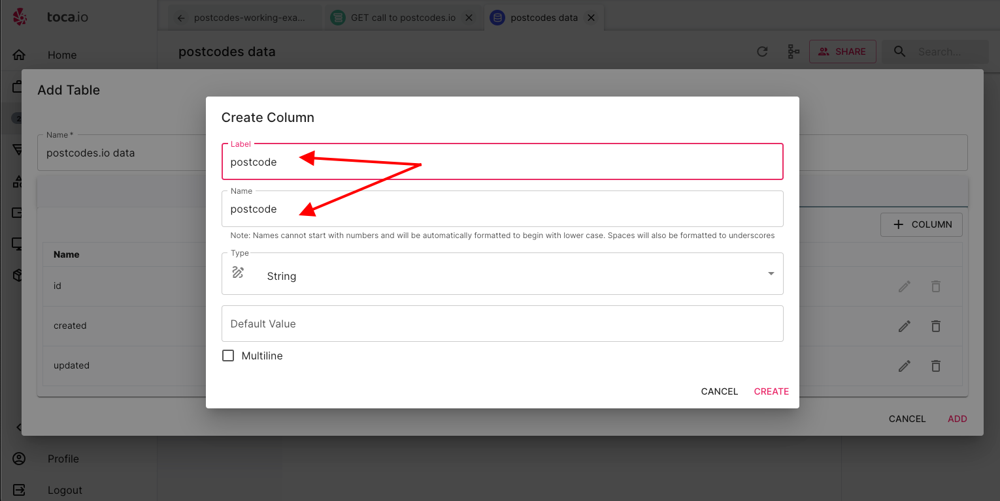
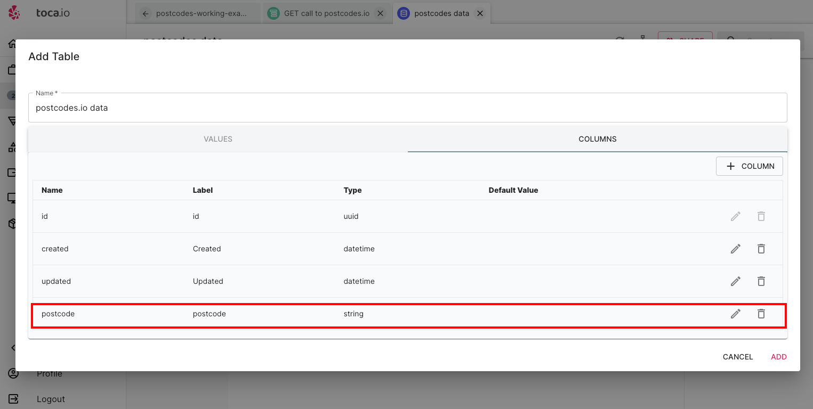

# Making API GET Calls and Managing Data

**Purpose:** The aim of this section is to show how to make API calls to a service as well as handle JSON responses into a Datastore for future use.

**Prerequisites:** RESTful API understanding, use of Toca actions, awareness of datastores, JSON and acess to Toca.

## Table of Contents


1. [Pre-requisites](#pre-requisites)
2. [Creating a Base URL](#creating-our-base-url)
3. [Making Our API Call](#making-our-api-call)
4. [Data Storage](#data-storage)
5. [Capturing Our JSON Data](#capturing-our-json-data)
6. [Adding Our Data to Our Datastore](#adding-our-data-to-our-datastore)
7. [Conclusion](#conclusion)

## Pre-requisites

As part of this section we will be utilising a service calle [postcodes.io](https://postcodes.io/) which is an open source API. Postcodes.io allows UK postcode data to be queried over a JSON HTTP API.

Please note that as part of this guide:

- The Automation project has already been setup.
- The creation of an `activity` has already taken place.
- The focus will be on the `actions` and `Datastore` management to deal with requested and response data.
- All information regarding the service used can be found in the README.md at the root of the `making-API-calls` folder and we will be assuming this has been reviewed.

What will be covered:

- Making API calls
- Extracting data from JSON
- Text manipulation
- Datastore creation and management
- Writing a row to a Datastore
- Using Inputs, Outputs and Variables

*Getting Started*


As you can see in the image above we already have a project started and have selected some of the actions we will need. Also, we will be using a Stateless Bot as we do not need any interaction with any apps or screens.

## Creating Our Base URL

An integral part of effective automation management is the practice of abstraction and data injection whenever possible. The required URL structure follows this pattern:

- `https://api.postcodes.io/postcodes/<postcode>`

  - For instance, `https://api.postcodes.io/postcodes/swa12aa`

The API itself only requires appending a single postcode to the end of the string without spaces, as it is an integral part of the URL.

In this practical example, we will employ an `INPUT` to define our base URL and establish a default value. The primary reason for choosing this approach is to maintain a straightforward workflow. If you find the need for multiple 'environment variables,' it is advisable to consider using a Datastore.


In the above image, you can observe that we have:

- Created an `INPUT` named `base-url`, with a data type of `Text`.
- Assigned the default value as `https://api.postcodes.io/postcodes/`.

## Allowing for different postcodes

We will create another variable that will take an INPUT when running our activity. So, we will create another variable but without a default to allow inputing the postcode by running out Activity with `Start With Inputs`.

Again this will be a `Text` Input called `entered-postcode`:


although you may see an warning about leaving no default value it will not cause any issues.

## Combining our INPUT variables for a full URL

We will now use a `Text Manipulation` action to bring our INPUT variables together.

First we select the text manipulator action:


We now update the:

- Description - Always provide clear descriptions
- Change the manipulation to join
- and then select the `{x}` icon to select the text to manipulate


We then need to select our `base-url` variable from the variables section.


Then utilising the `{x}` icon on `Text to add` we need to follow the same process and select our `entered-postcode` variable.


Our join is now set up as below


The last thing to do is create our joined variable from the text manipulation action.

Scroll down and select the arrow at the edge of the vairable section as in figure 1 in the image below:


We will then need to select the `+` next to the output of `result` and name our variable as in figure 2 and lastly we need to name and hit the `SET VARIABLE` button as in figure 3 and the highlighted button.


We have now prepared out dynamic URL to be used in an API GET call.

## Making Our API Call

To make our API call, we need to select the `API Caller` action, as shown in the image below:


As depicted below, we will need to:

- Provide a description of what the API caller does.
- Select the transport layer as `HTTP` from the dropdown menu. Note that this will open up the following options:
  - Method, of which we will need to select `GET`.


In the next step, we need to select the `{x}` search element to choose our GET call URL that we created. Simply click on the variables and select the correct data chip for the full URL:


Next, ensure that the output, specifically the result of the call, is captured in a variable named simply `JSONResponse`, as shown below:


Once the variable is set, simply save our action, and we're ready to run a test:


### Testing Our Setup So Far

We have reached a stage where we can run our `Activity` to check if everything is functioning as expected:


Input the postcode `SW1A2AA` (without spaces; although spaces should be managed when encoding the URL):


Hopefully, as shown in the image below, your Activity run will appear in the console log, and you will be able to select and inspect the response by clicking on the log item:


## Data Storage

Effective data management is crucial in any process, and we will be creating a `Datastore` to store data components from the captured JSON. This will enable us to use the data at a later date and make necessary changes as needed.

### Creating Our Datastore and Table

Within our core project, follow these steps to add a Datastore:

1. Select `Add Datastore`:

   

2. As you type the label, the name will automatically match:

   

3. After adding the Datastore, we need to create a table within it to hold specific data in the form of columns for future use.

   

4. By default, you will see three columns: `ID`, `created`, and `updated`, which are automatically populated, similar to many databases.

   

5. Make sure to provide a name for the table before adding columns for the specific data you intend to capture.

   

6. Next, add a column to capture both the `postcode` and `admin_district` from our response. Here's an example of adding a `postcode` column with the data type set as string:

   

7. Repeat the same process but use `location` as the name of the column.

8. Once you've completed adding the necessary columns, you will see them in place. Finally, add (press the add button) the table to your Datastore:

   

## Capturing Our JSON Data

We have a working call to the `postcodes.io` service, and data is being returned in the following JSON format:

```json
{
    "status": 200,
    "result": {
        "postcode": "SW1A 2AA",
        "quality": 1,
        "eastings": 530047,
        "northings": 179951,
        "country": "England",
        "nhs_ha": "London",
        "longitude": -0.127695,
        "latitude": 51.50354,
        "european_electoral_region": "London",
        "primary_care_trust": "Westminster",
        "region": "London",
        "lsoa": "Westminster 018C",
        "msoa": "Westminster 018",
        "incode": "2AA",
        "outcode": "SW1A",
        "parliamentary_constituency": "Cities of London and Westminster",
        "admin_district": "Westminster",
        "parish": "Westminster, unparished area",
        "admin_county": null,
        "date_of_introduction": "198001",
        "admin_ward": "St James's",
        "ced": null,
        "ccg": "NHS North West London",
        "nuts": "Westminster",
        "pfa": "Metropolitan Police",
        "codes": {
            "admin_district": "E09000033",
            "admin_county": "E99999999",
            "admin_ward": "E05013806",
            "parish": "E43000236",
            "parliamentary_constituency": "E14000639",
            "ccg": "E38000256",
            "ccg_id": "W2U3Z",
            "ced": "E99999999",
            "nuts": "TLI32",
            "lsoa": "E01004736",
            "msoa": "E02000977",
            "lau2": "E09000033",
            "pfa": "E23000001"
        }
    }
}
```

We are interested in capturing two data points from the results section: `postcode` (e.g., `SW1A 2AA`) and `admin_district` (e.g., `Westminster`) in this example.

Before proceeding, let's quickly run our Activity with the input of `sw1a2aa` and execute it, so we have some data in the console - the reason for this will become clear later when Toca exposes some log data:


Now that we have a console-logged run, let's add our JSON Navigator action:


Next, we need to select the JSON data chip we wish to work with:


As we have already run the activity and there is data in the console log, Toca displays what the data will be. Simply select the `JSONResponse` data chip:


Now, we want to select one item from the dropdown menu, as shown below, because we will be addressing each data component individually:


### Understanding JSON Path

To access JSON data Toca uses JSON path which ais a simple programitical way to access layers of JSON data.

Let's say you have the following JSON data representing a list of books:

```json
{
  "library": {
    "books": [
      {
        "title": "The Great Gatsby",
        "author": "F. Scott Fitzgerald"
      },
      {
        "title": "To Kill a Mockingbird",
        "author": "Harper Lee"
      },
      {
        "title": "1984",
        "author": "George Orwell"
      }
    ]
  }
}
```

Now, let's say you want to extract the titles of all the books in the "library" using JSONPath.

The JSONPath expression for this would be:

``` text
$.library.books[*].title
```

Here's how it works:

- `$.` indicates the root of the JSON object.
- `library` is the key to access the "library" object.
- `books` is an array within the "library" object.
- `[*]` selects all elements in the "books" array.
- `title` is the key to extract the "title" value from each book.

So, when you apply this JSONPath expression to the JSON data, you will get the following result:

``` python
[
  "The Great Gatsby",
  "To Kill a Mockingbird",
  "1984"
]
```

This result includes the titles of all the books in the "library" as requested. JSONPath is a powerful tool for querying and extracting specific data from JSON structures.

### Using JSON Path for Our Example

In the provided JSON response, there are two root tags, `"status"` and `"result"`. We are interested in the data within the `"result"` section, specifically the `"postcode"` and `"admin_district"`.

```json
{
    "status": 200,
    "result": {
        "postcode": "SW1A 2AA",
        "quality": 1,
        "eastings": 530047,
        "northings": 179951,
        "country": "England",
        "nhs_ha": "London",
        "longitude": -0.127695,
        "latitude": 51.50354,
        "european_electoral_region": "London",
        "primary_care_trust": "Westminster",
        "region": "London",
        "lsoa": "Westminster 018C",
        "msoa": "Westminster 018",
        "incode": "2AA",
        "outcode": "SW1A",
        "parliamentary_constituency": "Cities of London and Westminster",
        "admin_district": "Westminster",
        // More data
    }
}
```

To access the data within the keys of `"postcode"` and `"admin_district"`, they must be added to our JSON navigator with the following JSON Path queries:

- `$.result.postcode`


Lastly, we want to ensure that our data is then output to a variable that can be used in following processes. We have named it `JsonPostcodeRespVal`:


### Following the same process for admin_district

We need to follow exactly the same process for the `admin_distritct` as we have done for our postcode value.

The JSON path for this one will be `$.result.admin_district`. The output variable will be named `adminDistRespVar`.

## Running our activity to test

As before if we now run our activity and pass in our `sw1a2aa` postcode we should now see the console log of data parsed:

We should see both our JSON parsing reponses in the console log.


## Adding Our Data to Our Datastore

Last but not least, now that we are confident we have gathered our data, the final step is to store it in the table within our Datastore that we created earlier.

1. We will need to select `tables` and then choose the `manipulation` action:

   

2. Followed by selecting `add row to table` for our required action:

   

3. Provide a description and then select the `{x}` icon for `Table`. Identify our Table data chip from our Datastore:

   

   Simply selecting the Datastore will highlight the table data chip as below:

   

4. In the image below, you can see that the columns from the table we created are now available. The `id`, `Created`, and `Updated` times will automatically be added.

   

5. We now need to select our `postcode response` and `adminDist response` for our respective columns:

   - to do so select the `{x}` nex to the`postcode` row for the Postcode column and select the respective datachip:

     

   - Repeat the process for the `location` and `admin_district` data.

6. With all our data prepped and our add table row set up, we should be able to run our activity to write to our datastore.

### Our Final Test

As we have been doing throughout, let's run our activity with the input of `sw1a2aa` and execute it for the last time. We should see a clear run in our console log, i.e., no errors. If we head to our datastore and edit the table, we should now have one record in place as below:


And we should now see our data captured within our table:


## Conclusion

In this comprehensive guide, we've walked through the process of setting up and executing a series of actions using Toca to interact with an external API, capture JSON data, and store it in a Datastore. We've covered everything from defining the base URL to making API calls, extracting specific data using JSON Path, and finally, adding this data to our Datastore.

This workflow allows us to not only retrieve data from an external source but also store it systematically for future use or analysis. By following these steps, we've successfully demonstrated the power of Toca for automating data retrieval and management tasks.
